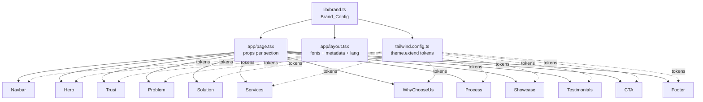

# Design Document

## Overview

This document specifies the technical design for the **Atap Kreatif Manajemen** marketing landing page, a single-page Next.js 14 (App Router) experience that introduces the agency, communicates the six-service offering, presents trust signals (distribution & KOL databases), explains the four-step workflow, and converts visitors via a WhatsApp / email primary path.

The design is governed by three non-negotiable principles drawn from the requirements:

1. **Editorial, fashion-magazine feel.** Bold display typography (Poppins), restrained palette (Pageant Blue / Matte Green / Catacomb Walls), generous negative space, asymmetric layouts, full-bleed imagery — explicitly *not* a generic SaaS template, and explicitly *no* parallax, autoplay carousels, scroll-jacking, or floating-blob backgrounds (Requirement 7).
2. **Brand_Config as single source of truth.** Every brand-specific string, link, color, and stat lives in `lib/brand.ts`. Components contain layout, motion, and accessibility logic only — no hard-coded brand literals (Requirement 2, Requirement 11.7–11.8).
3. **No fabrication, ever.** Every piece of rendered copy traces back to the Source_Doc or to neutral connective text. Missing brand inputs produce structural placeholders + `TODO(brand):` markers, never invented testimonials, awards, ratings, or stats (Requirement 10, Requirement 14.7, Requirement 16.9).

The implementation stack:
- **Next.js 14+ App Router** with React Server Components by default; the `"use client"` boundary is pushed to the smallest possible leaves (mobile menu, motion wrappers).
- **TypeScript strict** (`strict: true`, `noImplicitAny: true`, no `@ts-ignore` per Requirement 13.1).
- **Tailwind CSS** with brand tokens injected from `lib/brand.ts` so updating a token propagates everywhere (Requirement 2.5).
- **Framer Motion** for restrained `fade / slide / scale / stagger` only, with full `prefers-reduced-motion` honoring (Requirements 6.7, 7.1, 7.4).
- **shadcn/ui** patterns (Button, Sheet for mobile menu) to avoid reinventing accessible primitives.
- **next/font** for Poppins (Google) and a local `next/font/local` slot for Helvetica (with a Helvetica → Helvetica Neue → Arial → system-ui → sans-serif CSS fallback per Requirement 18.3–18.4).
- **next/image** for every raster asset with explicit `width`/`height` to keep CLS at 0 (Requirement 9.5).

The design output is one route (`app/page.tsx`), ten Section_Components in `components/`, a `lib/brand.ts` config module, a `tailwind.config.ts` mapping tokens to that module, a `lib/motion.ts` helper for shared variants, and a single `app/layout.tsx` that wires fonts, metadata, and the `<html lang>` attribute.

## Architecture

### File tree

```
new-compro-atap/
├── app/
│   ├── layout.tsx              # <html lang>, font loading, global metadata, providers
│   ├── page.tsx                # Composes the 10 Section_Components in order (Req 12.4)
│   ├── globals.css             # Tailwind base + custom CSS variables for tokens
│   └── opengraph-image.tsx     # (optional) OG image route — emits TODO(brand) if logo missing
├── components/
│   ├── Navbar.tsx              # Req 12.1 — exact filename, default export
│   ├── Hero.tsx
│   ├── Trust.tsx               # Trust_Section (distribution + KOL databases)
│   ├── Problem.tsx
│   ├── Solution.tsx
│   ├── Services.tsx
│   ├── WhyChooseUs.tsx         # Why_Choose_Us_Section
│   ├── Process.tsx
│   ├── Showcase.tsx
│   ├── Testimonials.tsx
│   ├── CTA.tsx
│   ├── Footer.tsx
│   ├── ui/                     # shadcn/ui primitives (Button, Sheet, etc.)
│   └── motion/
│       ├── MotionSection.tsx   # Client wrapper for in-view fade/slide
│       └── Stagger.tsx         # Stagger container
├── lib/
│   ├── brand.ts                # Req 12.2 — Brand_Config single source of truth
│   ├── metadata.ts             # buildMetadata(brand) → Next.js Metadata
│   ├── motion.ts               # Shared Framer Motion variants
│   └── utils.ts                # cn() helper, formatPhone(), buildWhatsAppHref()
├── public/
│   ├── brand/
│   │   ├── logo.svg            # If absent → TODO(brand) typographic fallback
│   │   └── og-default.jpg      # If absent → metadata omits openGraph.images
│   └── fonts/
│       └── helvetica/          # If absent → CSS fallback stack used (no TODO marker — Req 18.4)
├── tailwind.config.ts          # Maps brand tokens → theme.extend.colors / fontFamily / borderRadius
├── tsconfig.json               # strict: true
├── eslint.config.mjs           # Errors-only at build time (Req 13.2)
└── package.json
```

### App Router layout

`app/layout.tsx` is responsible for:
- Setting `<html lang={brand.locale.split('-')[0]}>` (Requirement 6.1, 17.4).
- Loading `Poppins` via `next/font/google` with weights `[400, 600, 700]` plus italic, exposed as a CSS variable `--font-display`.
- Loading `Helvetica` via `next/font/local` *if* a font file exists in `public/fonts/helvetica/`; otherwise the CSS fallback stack from Brand_Config is applied directly. Either path produces a `--font-body` CSS variable.
- Rendering global metadata via `lib/metadata.ts` (Requirement 8).
- Setting `<body className="bg-background text-foreground font-body antialiased">` so the brand background is the page default (Requirement 18.7).

`app/page.tsx` is a Server Component that:
- Imports `brand` from `@/lib/brand`.
- Renders the **Skip to main content** link as the first focusable element (Requirement 6.3).
- Wraps `<Navbar>` in `<header>`, the body sections in `<main id="main-content">`, and `<Footer>` in `<footer>` (Requirement 1.2–1.3).
- Renders the ten Section_Components in the exact order: `Navbar, Hero, Trust, Problem, Solution, Services, WhyChooseUs, Process, Showcase, Testimonials, CTA, Footer` (Requirement 1.1, 12.4).
- Passes the relevant slice of Brand_Config to each section as props rather than letting each section import the full module — this enables straightforward unit testing with empty / partial fixtures (Requirement 1.6, 10.4).

### Where Brand_Config is consumed



The brand tokens flow into Tailwind's theme; the brand content flows through `page.tsx` props. Components never reach back into `lib/brand.ts` directly, which keeps them deterministic for tests and free of hidden coupling.

### Rendering boundaries

| Concern | Boundary | Why |
|---|---|---|
| Layout, copy, structure | Server Component | Zero JS shipped; SEO-friendly |
| Mobile menu open/close | Client (`Navbar` splits into `Navbar.server.tsx` + `MobileMenu.client.tsx`) | Stateful UI |
| In-view entrance motion | Client (`MotionSection`) | Framer Motion needs `useInView` |
| Year in footer | Server (computed at request time) | No hydration, no flash |
| Reduced-motion check | Client inside motion wrappers | `useReducedMotion()` is browser-only |

## Components and Interfaces

Each section accepts a typed props object. The shape of those props is a slice of the `Brand` type from `lib/brand.ts` — no `any`, no implicit any (Requirement 12.3). Every section renders its top-level heading with a stable `id` and references it from the parent `<section aria-labelledby={id}>` (Requirement 1.4).

### Shared primitives

```ts
// components/ui/Button.tsx (shadcn-style)
type ButtonVariant = "primary" | "secondary" | "ghost";
interface ButtonProps {
  variant?: ButtonVariant;
  href?: string;            // renders <a> if present, else <button>
  ariaLabel?: string;
  children: React.ReactNode;
}
```

- `variant="primary"` → `bg-primary text-background hover:bg-primary/90`.
- `variant="secondary"` → `border border-primary text-primary hover:bg-primary/10`.
- All variants ensure a 44×44 hit target via `min-h-11 min-w-11 px-5 py-3` (Requirements 4.1–4.4, 5.8).
- Visible focus ring: `focus-visible:outline focus-visible:outline-2 focus-visible:outline-offset-2 focus-visible:outline-accent` to give a 3:1 ring against `bg-background` (Requirement 6.5).

### Section: Navbar (`components/Navbar.tsx`)

**Props**
```ts
interface NavbarProps {
  brandName: string;
  shortName: string;
  wordmark: string;
  logoSrc?: string;            // Req 18.5–18.6 — typographic fallback if absent
  nav: { label: string; href: string }[];
  primaryCta: { label: string; href: string };
}
```

**Layout intent**
- Sticky top bar, `h-16` mobile / `h-20` desktop, `bg-background/80 backdrop-blur` so it floats over editorial imagery without obscuring the wordmark.
- Three-region grid: logo (left), nav links (center on desktop, hidden on mobile), Primary_CTA (right on tablet+).
- Mobile (≤767px): logo + Primary_CTA hidden in nav region, burger trigger reveals a `Sheet` (shadcn) containing the nav links and Primary_CTA (Requirement 5.2, 4.2).

**Responsive behavior**
- `md:` breakpoint flips `hidden md:flex` for desktop nav and `md:hidden` for the mobile trigger (Requirement 5.3).
- Mobile menu open/close transition ≤300ms (Requirement 5.7) using Framer Motion `<AnimatePresence>` with a fade+slide variant (or instant when reduced-motion).

**Motion treatment**
- On mount, the navbar fades in over 200ms.
- Hover/focus on nav links: 150ms color transition `text-primary/80 → text-primary` (Requirement 7.5).
- No scroll-linked motion. No transform on scroll.

**Brand color usage**
- Surface: `bg-background` with `text-primary` for links.
- Primary_CTA: `bg-primary text-background`.
- Wordmark: rendered as `<svg>` from `logoSrc` *or* the typographic fallback `<span class="font-display font-bold tracking-tight text-primary">ATAP KREATIF</span>` plus a `// TODO(brand): Navbar — missing brand.assets.logoSvg` comment (Requirement 18.6, 10.1, 10.5).

### Section: Hero (`components/Hero.tsx`)

**Props**
```ts
interface HeroProps {
  headline: string;            // single <h1> — Req 3.4, 6.2, 8.2
  paragraph: string;
  primaryCta: { label: string; href: string };
  secondaryCta: { label: string; href: string };
  visual?: { src: string; alt: string; width: number; height: number };
  eyebrow?: string;            // small editorial label e.g. "Creative & Digital Agency · Madiun"
}
```

**Layout intent (editorial, asymmetric)**
- 12-column CSS grid on desktop. Headline occupies columns 1–8 set in oversized Poppins Bold (`text-5xl md:text-7xl lg:text-8xl`), with intentional line breaks via `<br aria-hidden="true">` only when the headline string is short enough to control wrapping deterministically.
- Eyebrow (`text-xs uppercase tracking-[0.2em] text-accent`) sits above the headline.
- Supporting paragraph in columns 1–6, body face, generous leading (`leading-relaxed max-w-prose`).
- Visual (when provided) occupies columns 7–12, full-bleed to the right edge of the viewport (overflowing the container by negative margin) to evoke a magazine spread. When absent, the visual slot becomes a typographic poster: oversized "ATAP KREATIF" wordmark fragment in `text-accent/40`, decorative triangular "A" shape SVG inspired by the logo geometry (Requirement 18.10).
- Mobile: single column, headline first, paragraph, then CTAs stacked, then visual at the bottom (Requirement 5.4).

**Responsive behavior**
- All four content elements (headline, paragraph, primaryCta, secondaryCta) remain in the viewport without horizontal scroll from 320–1920px (Requirement 3.6, 5.1).
- Visual `next/image` uses `priority` and `sizes="(min-width: 1024px) 50vw, 100vw"`.

**Motion treatment**
- On mount, headline runs a stagger: word-by-word fade+slide (12px → 0) with 60ms stagger, total ≤500ms.
- Paragraph and CTAs follow with a single fade-in delayed 250ms, ≤400ms duration.
- Reduced-motion: render in final state with zero duration (Requirement 7.4).

**Brand color usage**
- Surface: `bg-background`. Headline: `text-primary`. Eyebrow / accent shape: `text-accent`. CTAs: primary filled, secondary outlined.

**Tab order** (Requirement 3.5): Skip-link → Navbar interactive elements → Hero Primary_CTA → Hero Secondary_CTA → rest of page.

### Section: Trust (`components/Trust.tsx`)

**Props**
```ts
interface TrustProps {
  heading: string;             // e.g. "Distribution & KOL Database"
  intro?: string;
  distribution: { platform: string; accounts: number }[];   // length 6
  kol: { tier: string; count: number | "menyusul" }[];      // length 4 or 5
}
```

**Layout intent**
- Two stacked groups under one `<h2>`: "Distribution Network" and "KOL Database".
- Each group is a horizontally-scrollable strip on mobile (`overflow-x-auto snap-x` — *not* an autoplaying carousel, scroll is purely user-driven, so it does not violate Requirement 7.2) and a multi-column grid on tablet+ (Requirement 5.6).
- Each stat card: large Poppins number (`text-5xl md:text-6xl text-primary`), platform/tier label below in body face (`text-sm uppercase tracking-wide text-primary/70`).
- Mega tier renders the label only when `count === "menyusul"`, with a small italic note "menyusul" in `text-accent` and *no* numeric (Requirement 10.6, 14.2).

**Motion treatment**
- Stats stagger-in (40ms per item) when the section enters view, fading from `opacity 0 translate-y-2` to final. Total ≤500ms.
- No count-up animation (count-up is a gimmick that violates the editorial restraint principle).

**Brand color usage**
- Background: `bg-background`. Card background: `bg-primary/5` with `border-primary/10`. Numbers: `text-primary`. Labels: `text-primary/70`.

### Section: Problem (`components/Problem.tsx`)

**Props**
```ts
interface ProblemProps {
  eyebrow?: string;            // e.g. "The Problem"
  heading: string;
  body: string;                // 1–400 chars, paraphrased Source_Doc framing
  accentImage?: { src: string; alt: string; width: number; height: number };
}
```

**Layout intent (editorial split)**
- Two-column: left column = oversized pull-quote-style heading set in Poppins Bold against generous whitespace; right column = body paragraph + a small editorial accent image.
- Mobile: single column, image last.

**Motion treatment**
- Heading slides up 16px and fades in over 400ms when the section enters view.
- Body paragraph fades in with a 100ms delay.

**Brand color usage**
- Surface: `bg-background`. Heading: `text-primary`. Body: `text-primary/80`. Accent rule (`<hr>` between heading and body on mobile): `border-accent`.

### Section: Solution (`components/Solution.tsx`)

**Props**
```ts
interface SolutionProps {
  heading: string;
  body: string;
  pillars: { title: string; description: string; icon?: string }[];   // 4–6 items
}
```

**Layout intent (bento grid)**
- Asymmetric 6-column bento on desktop: one large hero card (cols 1–4, rows 1–2) plus four smaller cards (cols 5–6 stacked, plus two below the hero). The largest card carries the brand promise sentence with the wordmark color; the smaller cards each hold one pillar.
- Tablet: 2-column grid, large card spans both. Mobile: single column (Requirement 5.4, 5.6).
- Cards use `rounded-md` (8px) — never larger than the `1rem` ceiling (Requirement 18.11, 11.4).

**Motion treatment**
- Cards stagger-in with `fade + scale 0.98 → 1` over 350ms, 60ms stagger, when section is 25% in view (Requirement 7.3).

**Brand color usage**
- Hero card: `bg-primary text-background`. Smaller cards: `bg-background border border-primary/15 text-primary`. Icons: `text-accent`.

### Section: Services (`components/Services.tsx`)

**Props**
```ts
interface ServiceEntry {
  id: string;                  // stable slug for aria-controls / anchor
  title: string;               // exactly the 6 names in Req 16.4
  summary: string;             // 80–280 chars
  items: string[];             // 3–8 deliverable bullets
  icon?: React.ReactNode;      // Lucide icon
}
interface ServicesProps {
  heading: string;
  intro?: string;
  services: ServiceEntry[];    // length 6 (Req 16.4)
}
```

**Layout intent (editorial bento, 6 cards)**
- Desktop: 3 columns × 2 rows. Each card is full-height, with a numerical marker ("01"–"06") in oversized Poppins, the title, the summary, and the bullet list (`<ul role="list">`).
- Tablet: 2 columns × 3 rows. Mobile: 1 column × 6 rows.
- Cards use `rounded-md` and a hairline `border-primary/15`. Hover state lifts the card 2px (`hover:-translate-y-0.5 transition-transform`) within 200ms (Requirement 7.5).
- Number markers use `text-accent` to give the page rhythm without introducing a new hue (Requirement 18.8).

**Responsive behavior**
- `grid-cols-1 md:grid-cols-2 lg:grid-cols-3` (Requirement 5.6).
- Bullet lists collapse into a tighter rhythm on mobile (`text-sm leading-snug`).

**Motion treatment**
- Cards stagger-fade-in (50ms stagger, 350ms each) on view entry; reduced-motion → instant.

### Section: WhyChooseUs (`components/WhyChooseUs.tsx`)

**Props**
```ts
interface WhyChooseUsProps {
  heading: string;
  reasons: { title: string; description: string }[];   // 3–5 (Req 16.6)
}
```

**Layout intent**
- Vertical numbered list (large numerals in Poppins, `text-accent`), each row is `grid-cols-[auto_1fr] gap-8` on desktop. The list reads like editorial copy — wide left margin, restrained right column.
- Mobile: same list, tighter margins.

**Motion treatment**
- Each row enters with 60ms stagger, fade + slide-up 8px, ≤300ms.

### Section: Process (`components/Process.tsx`)

**Props**
```ts
interface ProcessProps {
  heading: string;
  steps: { step: number; title: string; description: string }[];   // length 4 (Req 16.7)
}
```

**Layout intent**
- Horizontal 4-column timeline on desktop with a thin `border-accent` connector between cards. Each step shows "01"/"02"/"03"/"04" in `text-7xl text-primary/15` behind the title.
- Tablet: 2×2 grid. Mobile: vertical timeline (left rail with dots).
- Dots and connectors use `bg-accent` for visual continuity.

**Motion treatment**
- Connector line draws in (`scaleX 0 → 1`, origin-left) over 600ms once the section is in view (Requirement 7.3).
- Each step card fades in sequentially with 100ms stagger.
- Reduced-motion: connector renders fully drawn, cards in final state (Requirement 7.4).

### Section: Showcase (`components/Showcase.tsx`)

**Props**
```ts
interface ShowcaseEntry {
  title: string;
  category?: string;                // e.g. "Account handling"
  href?: string;                    // optional case-study link
  image: { src: string; alt: string; width: number; height: number };
}
interface ShowcaseProps {
  heading: string;
  intro?: string;
  entries: ShowcaseEntry[];         // 0+ — empty triggers placeholder grid (Req 10.3)
}
```

**Layout intent (full-bleed editorial)**
- Asymmetric masonry-style grid on desktop: alternating tall/wide tiles, with full-bleed treatment for the first tile (extends to viewport edge with negative margins). Captions sit under each image in small caps Poppins (`text-xs uppercase tracking-widest text-primary/70`).
- Mobile: vertical stack, each tile full width, generous gap (Requirement 18.9).
- When `entries.length === 0`, render 3 `aspect-[4/5] bg-primary/5 border border-primary/10 rounded-md` slots and emit `// TODO(brand): Showcase — missing brand.showcase entries`. Identical dimensions to populated layout (Requirement 10.3, 13.4).

**Motion treatment**
- Tiles fade-in + scale `0.985 → 1` on view, 80ms stagger, ≤450ms each.
- Hover on linked tiles: image scales `1 → 1.02` over 250ms within an `overflow-hidden` wrapper (Requirement 7.5).

**Brand color usage**
- Tiles render against `bg-background`. Captions in `text-primary`. Optional overlay text on imagery uses `text-background` over a `bg-primary/40` gradient (Requirement 18.9–18.10).

### Section: Testimonials (`components/Testimonials.tsx`)

**Props**
```ts
interface TestimonialEntry {
  quote: string;            // 1–280 chars
  name: string;             // 1–60 chars
  role: string;             // 1–80 chars
}
interface TestimonialsProps {
  heading: string;
  entries: TestimonialEntry[];   // 0+ — empty triggers 3–6 placeholder slots (Req 10.2)
}
```

**Layout intent**
- 2-column grid on desktop, each card shows an oversized opening-quote glyph (decorative, `aria-hidden`) in Poppins, the quote in body face italic, and attribution "— Name, Role".
- Cards: `bg-primary/5 border border-primary/10 rounded-md p-8`.
- Empty state: render 3 placeholder cards with the *same* dimensions and spacing as a populated card, contents are visually-blank but DOM-present (skeleton lines via `bg-primary/10`); emit `// TODO(brand): Testimonials — missing brand.testimonials entries`. *No* fabricated names, quotes, or companies (Requirement 10.2, 14.5, 14.7).
- Filter rule: if any single entry is missing `quote`, `name`, *or* `role`, that entry is omitted entirely (Requirement 14.5) — partial cards never render.

**Motion treatment**
- Cards fade-in with 60ms stagger.

### Section: CTA (`components/CTA.tsx`)

**Props**
```ts
interface CtaProps {
  heading: string;
  body?: string;
  primaryCta: { label: string; href: string };
  secondaryCta: { label: string; href: string };
}
```

**Layout intent**
- Full-bleed band with `bg-primary text-background` to anchor the page visually before the footer. Centered content, oversized Poppins heading.
- CTAs side-by-side on tablet+, stacked on mobile.
- The Primary_CTA inside CTA is identical (label + href) to the one in Hero and Navbar (Requirement 2.3, 4.5).

**Motion treatment**
- Heading fades+slides in once in view; CTAs follow with 100ms delay.

### Section: Footer (`components/Footer.tsx`)

**Props**
```ts
interface FooterProps {
  brandName: string;
  shortName: string;
  wordmark: string;
  logoSrc?: string;
  description: string;
  contact: { email: string; whatsapp: string; address: string };
  social: { platform: string; href: string; label: string }[];
  yearOverride?: number;
}
```

**Layout intent**
- 4-column grid on desktop: brand block (logo + description) | nav | contact | social. Mobile: stacked.
- Email rendered as `mailto:` link, WhatsApp as `https://wa.me/` link with explicit `aria-label="Chat Atap Kreatif on WhatsApp"` (Requirement 15.3–15.4).
- Year: `yearOverride ?? new Date().getFullYear()` computed at render (Server Component) (Requirement 15.5–15.6).
- Social block omitted entirely when `social.length === 0` (Requirement 15.7).
- Logo fallback identical to Navbar (typographic + `TODO(brand)`).

**Brand color usage**
- `bg-primary text-background`, accent rule `border-accent/40`, social icons `text-background hover:text-accent`.

## Data Models

### `lib/brand.ts` — Brand_Config TypeScript schema

The schema below is the authoritative shape of `Brand_Config`. Every field maps directly to a Requirement 2.1 entry. All strings are intended to render as-is; no field is allowed to hold an ad-hoc CSS literal (per Requirement 11.8).

```ts
// lib/brand.ts

export type Locale = "id-ID" | "en";

export interface NavItem { label: string; href: string }
export interface CtaConfig { label: string; href: string }

export interface ServiceConfig {
  id: string;
  title: string;
  summary: string;     // 80–280 chars
  items: string[];     // 3–8 deliverable bullets
}

export interface WorkflowStep {
  step: number;        // 1..4
  title: string;
  description: string;
}

export interface DistributionStat { platform: string; accounts: number }

export interface KolStat {
  tier: string;
  count: number | "menyusul";
}

export interface ContactInfo {
  email: string;
  whatsapp: string;       // raw display, e.g. "0812-5892-2216"
  whatsappE164?: string;  // derived: "6281258922216" — used to build wa.me href
  address: string;
}

export interface SocialLink { platform: string; href: string; label: string }

export interface BrandColors {
  primary: string;        // #1F2C43
  accent: string;         // #7E8772
  background: string;     // #DCD7D4
  foreground: string;     // #1F2C43 (== primary by Req 18.1)
  muted: string;          // tint of background, expressed as Tailwind utility (no new hex)
}

export interface BrandFonts {
  display: string;        // "var(--font-display)"
  body: string;           // "var(--font-body)"
  fallbackBody: string;   // 'Helvetica, "Helvetica Neue", Arial, system-ui, sans-serif'
}

export interface BrandAssets {
  logoSvg?: string;       // "/brand/logo.svg" — optional
  ogImage?: string;       // "/brand/og-default.jpg" — optional
  heroVisual?: { src: string; alt: string; width: number; height: number };
}

export interface SeoConfig {
  title: string;          // 10–60 chars
  description: string;    // 50–160 chars
  siteUrl?: string;       // optional canonical
  twitterHandle?: string;
}

export interface Brand {
  name: string;
  shortName: string;
  wordmark: string;
  locale: Locale;
  tagline: string;
  description: string;
  nav: NavItem[];                             // 4–7
  primaryCta: CtaConfig;
  secondaryCta: CtaConfig;
  services: ServiceConfig[];                  // exactly 6
  workflow: WorkflowStep[];                   // exactly 4
  distributionDatabase: DistributionStat[];   // exactly 6
  kolDatabase: KolStat[];                     // 4 or 5
  contact: ContactInfo;
  social: SocialLink[];                       // 0–8
  testimonials?: TestimonialEntry[];          // optional — missing → placeholder grid
  showcase?: ShowcaseEntry[];                 // optional — missing → placeholder grid
  whyChooseUs: { title: string; description: string }[]; // 3–5
  colors: BrandColors;
  fonts: BrandFonts;
  assets: BrandAssets;
  seo: SeoConfig;
}
```

### Concrete values (sourced from Source_Doc and Brand_Guidelines)

```ts
export const brand: Brand = {
  name: "Atap Kreatif Manajemen",        // id-ID per Req 2.1
  shortName: "Atap Kreatif",
  wordmark: "ATAP KREATIF",
  locale: "id-ID",
  tagline: /* TODO(brand): brand.tagline — Source_Doc tagline */ "",
  description:
    "Atap Kreatif Manajemen is a creative and digital marketing agency based in Madiun, " +
    "founded in 2025 and led by Jalu Pamenang. We integrate buzzers, clippers, KOLs, " +
    "advertising, development, and creative production into one accountable workflow.",
  nav: [
    { label: "Services", href: "#services" },
    { label: "Process", href: "#process" },
    { label: "Showcase", href: "#showcase" },
    { label: "Contact", href: "#cta" },
  ],
  primaryCta: { label: "Chat on WhatsApp", href: "https://wa.me/6281258922216" },
  secondaryCta: { label: "Email Us", href: "mailto:atapkreatifmanagement@gmail.com" },
  services: [
    { id: "buzzer",     title: "Buzzer Distribution", summary: "...", items: ["...","...","..."] },
    { id: "clipping",   title: "Content Clipping",    summary: "...", items: ["...","...","..."] },
    { id: "talent",     title: "Talent Management",   summary: "...", items: ["...","...","..."] },
    { id: "ads",        title: "Digital Advertising", summary: "...", items: ["...","...","..."] },
    { id: "dev",        title: "Development",         summary: "...", items: ["...","...","..."] },
    { id: "creative",   title: "Creative Production", summary: "...", items: ["...","...","..."] },
  ],
  workflow: [
    { step: 1, title: "Initial",     description: "Negotiating KPIs and project requirements." },
    { step: 2, title: "Preparation", description: "Preparing client and internal needs." },
    { step: 3, title: "Execution",   description: "Delivering on the agreed requirements." },
    { step: 4, title: "Reporting",   description: "Reporting outcomes back to the client." },
  ],
  distributionDatabase: [
    { platform: "TikTok",    accounts: 650 },
    { platform: "Instagram", accounts: 650 },
    { platform: "Facebook",  accounts: 400 },
    { platform: "Twitter/X", accounts: 350 },
    { platform: "Threads",   accounts: 500 },
    { platform: "YouTube",   accounts: 250 },
  ],
  kolDatabase: [
    { tier: "NonFoll",   count: 1500 },
    { tier: "Nano KOL",  count: 550 },
    { tier: "Micro KOL", count: 100 },
    { tier: "Macro KOL", count: 70 },
    { tier: "Mega KOL",  count: "menyusul" },
  ],
  contact: {
    email: "atapkreatifmanagement@gmail.com",
    whatsapp: "0812-5892-2216",
    whatsappE164: "6281258922216",
    address:
      "Jl. Cokrokusumo No. 2a, Kelurahan Kuncen, Kecamatan Taman, Kota Madiun, Jawa Timur",
  },
  social: [
    // TODO(brand): brand.social — Source_Doc social handles
  ],
  whyChooseUs: [
    { title: "Integrated digital ecosystem",  description: "..." },
    { title: "Community-based activation",    description: "..." },
    { title: "Adaptive campaign strategies",  description: "..." },
    { title: "Measurable workflows",          description: "..." },
  ],
  colors: {
    primary:    "#1F2C43",
    accent:     "#7E8772",
    background: "#DCD7D4",
    foreground: "#1F2C43",
    muted:      "rgb(220 215 212 / 0.6)", // tint of background via opacity utility token
  },
  fonts: {
    display:      "var(--font-display)",
    body:         "var(--font-body)",
    fallbackBody: 'Helvetica, "Helvetica Neue", Arial, system-ui, sans-serif',
  },
  assets: {
    // TODO(brand): brand.assets.logoSvg — supply public/brand/logo.svg
    // TODO(brand): brand.assets.ogImage  — supply public/brand/og-default.jpg
    // TODO(brand): brand.assets.heroVisual — supply hero photograph
  },
  seo: {
    title:       "Atap Kreatif Management — Creative & Digital Marketing Agency",
    description:
      "Atap Kreatif Management is a creative and digital marketing agency in Madiun, " +
      "integrating buzzers, KOLs, advertising, development, and creative production.",
    // siteUrl intentionally omitted until production domain confirmed (Req 8.4)
  },
};
```

### `tailwind.config.ts` — theme extension mapping

```ts
import type { Config } from "tailwindcss";
import { brand } from "./lib/brand";

export default {
  content: ["./app/**/*.{ts,tsx}", "./components/**/*.{ts,tsx}", "./lib/**/*.ts"],
  theme: {
    extend: {
      colors: {
        primary:    brand.colors.primary,
        accent:     brand.colors.accent,
        background: brand.colors.background,
        foreground: brand.colors.foreground,
        muted:      brand.colors.muted,
      },
      fontFamily: {
        display: ["var(--font-display)", "system-ui", "sans-serif"],
        body:    ["var(--font-body)", "Helvetica", '"Helvetica Neue"', "Arial", "system-ui", "sans-serif"],
      },
      borderRadius: {
        // Max 3 distinct radii (Req 11.4); largest ≤ 1rem (Req 18.11)
        sm: "0.25rem",  // 4px  — small chips, badges
        md: "0.5rem",   // 8px  — cards, buttons
        lg: "1rem",     // 16px — full-bleed showcase tiles (ceiling)
      },
      // Spacing inherits the default Tailwind scale; sections use only that scale (Req 11.3).
    },
  },
  plugins: [],
} satisfies Config;
```

The Tailwind theme references `brand.colors.*` directly — updating a hex in `lib/brand.ts` propagates to every `bg-primary` / `text-accent` class without component-level changes (Requirement 2.5, 18.2).

### `lib/metadata.ts` — SEO module

```ts
import type { Metadata } from "next";
import { brand } from "./brand";

export function buildMetadata(): Metadata {
  const title = brand.seo.title || `${brand.name} — ${brand.tagline || ""}`.trim();
  const description = brand.seo.description || brand.description.slice(0, 160);

  const og: NonNullable<Metadata["openGraph"]> = {
    title,
    description,
    siteName: brand.name,
    locale: brand.locale,
    type: "website",
    ...(brand.seo.siteUrl ? { url: brand.seo.siteUrl } : {}),
    ...(brand.assets.ogImage ? { images: [{ url: brand.assets.ogImage }] } : {}),
    // No fabricated images — TODO(brand) emitted at module top when assets.ogImage is missing (Req 8.6)
  };

  return {
    title,
    description,
    openGraph: og,
    twitter: { card: "summary_large_image", title, description },
    ...(brand.seo.siteUrl ? { alternates: { canonical: brand.seo.siteUrl } } : {}),
    // viewport is auto-injected by Next.js App Router; we do not override it (Req 8.5)
  };
}
```

### `lib/motion.ts` — Framer Motion variants

```ts
import type { Variants } from "framer-motion";

export const fadeUp: Variants = {
  hidden: { opacity: 0, y: 12 },
  visible: { opacity: 1, y: 0, transition: { duration: 0.4, ease: "easeOut" } },
};

export const fadeIn: Variants = {
  hidden: { opacity: 0 },
  visible: { opacity: 1, transition: { duration: 0.35, ease: "easeOut" } },
};

export const scaleIn: Variants = {
  hidden: { opacity: 0, scale: 0.985 },
  visible: { opacity: 1, scale: 1, transition: { duration: 0.45, ease: "easeOut" } },
};

export const stagger = (delay = 0.06): Variants => ({
  hidden: {},
  visible: { transition: { staggerChildren: delay } },
});

// All durations ≤ 600ms in line with Requirement 7.3.
```

The shared `MotionSection` client wrapper applies these variants and consults `useReducedMotion()`; when true, the element is rendered with `initial={false}` and the variants collapse to instant (Requirement 6.7, 7.4).


## Correctness Properties

> *A property is a characteristic or behavior that should hold true across all valid executions of a system — essentially, a formal statement about what the system should do. Properties serve as the bridge between human-readable specifications and machine-verifiable correctness guarantees.*

### Why PBT applies here

This is a UI-heavy feature, so it might look like a poor PBT candidate. But the most important rules in the requirements are *universal* over the input space of `Brand_Config`, viewport widths, and missing-field configurations:

- "For any valid Brand_Config, the page renders 12 sections in this order with one h1, one main, one header, one footer."
- "For any subset of brand fields cleared, every consumer renders a placeholder slot and emits exactly one matching `TODO(brand):` marker."
- "For any viewport width in [320, 1920], no horizontal overflow and every interactive control is ≥44×44."
- "For any non-empty `kolDatabase` entry whose count is `"menyusul"`, no fabricated number is rendered."

These are textbook universal-quantification properties. The variation across inputs (different brand fields cleared, different locales, different testimonial counts, different viewport widths) is exactly what reveals fallback bugs, ordering bugs, and discipline regressions that example-based tests miss.

PBT is **not** used for the aesthetic/copy-traceability requirements (16.1–16.3, 18.9–18.10) or for Lighthouse score thresholds (9.1–9.4, 9.7); those are integration tests and content reviews, captured in the Testing Strategy below.

### Property reflection — consolidating before testing

The full prework identified ~80 acceptance-criteria classifications. Many collapse into a smaller set of comprehensive properties. A non-redundant property set:

- **Single section-structure property** subsumes 1.1, 1.2, 1.3, 1.4, 12.4 — verifying section order *and* landmark count *and* labelled-by uniqueness in one render is more powerful than three separate properties.
- **Single missing-field fallback property** subsumes 1.5, 1.6, 2.4, 4.7, 10.1, 10.2, 10.3, 10.4, 10.5, 13.4, 18.6 — they are all the same rule shape ("missing input → placeholder + TODO(brand) + no broken text").
- **Single hit-target property** subsumes 4.1, 4.2, 4.3, 4.4, 5.8 — same rule ("every interactive control ≥44×44") quantified over viewport widths and brand configs.
- **Single CTA identity property** subsumes 2.3 and 4.5 and the Primary-CTA half of 16.8 — they all assert the same byte-equality.
- **Single typography-discipline property** subsumes 11.1, 11.2, 18.3 — Poppins on headings, body face on body, exactly two families.
- **Single color-token-propagation property** subsumes 2.5, 11.7, 18.1, 18.2.
- **Single locale-consistency property** subsumes 6.1, 17.1, 17.3, 17.4.
- **Single Source_Doc cardinality property** subsumes 14.1, 14.3, 14.4, 14.5, 16.4, 16.5, 16.6, 16.7 — they are all "the section renders exactly the entries in `brand.X` with bounded shape, in the canonical order."
- **Single heading-hierarchy property** subsumes 3.4, 6.2, 8.2.

After consolidation, **15 properties** remain. Each is independently meaningful, none is implied by another in the list.

---

### Property 1: Page structure and landmark integrity

*For any* valid `Brand_Config`, the rendered Landing_Page SHALL produce exactly one `<header>` containing the Navbar, exactly one `<main>` containing every non-Navbar/non-Footer Section_Component, exactly one `<footer>` containing the Footer, and the twelve sections SHALL appear in DOM order: Navbar, Hero, Trust, Problem, Solution, Services, WhyChooseUs, Process, Showcase, Testimonials, CTA, Footer; AND each Section_Component SHALL be a `<section>` whose `aria-labelledby` references an existing heading element with non-empty text, AND every such referenced label SHALL be unique within the page.

**Validates: Requirements 1.1, 1.2, 1.3, 1.4, 12.4**

---

### Property 2: Heading hierarchy with single h1

*For any* valid `Brand_Config`, the rendered Landing_Page SHALL contain exactly one `<h1>` element located inside the Hero section, AND the sequence of heading levels in DOM order SHALL never increase by more than one level between consecutive headings (no h1→h3, no h2→h4).

**Validates: Requirements 3.4, 6.2, 8.2**

---

### Property 3: Skip link is the first focusable control and lands focus on `<main>`

*For any* valid `Brand_Config` and *for any* viewport width in [320, 1920], the first tabbable element of the Landing_Page SHALL be the "Skip to main content" link, AND activating that link via Enter or Space SHALL move keyboard focus to the `<main>` landmark, AND immediately following the skip link in tab order the next four tabbable elements SHALL include all Navbar interactive controls followed by the Hero Primary_CTA followed by the Hero Secondary_CTA in that relative order.

**Validates: Requirements 3.5, 6.3**

---

### Property 4: Primary_CTA identity is byte-equal across every render site

*For any* valid `Brand_Config`, every rendered Primary_CTA control (in the Navbar, in the Hero, and in the CTA_Section) SHALL render the identical `label` string and `href` URL declared in `brand.primaryCta`, character-for-character, with no per-component overrides; AND the Secondary_CTA in the Hero and CTA_Section SHALL likewise render `brand.secondaryCta` exactly.

**Validates: Requirements 2.3, 4.5, 16.8**

---

### Property 5: Hit target floor for all interactive controls

*For any* valid `Brand_Config` and *for any* viewport width in [320, 1920], every interactive control rendered on the Landing_Page (links, buttons, mobile menu trigger, Primary_CTA at every render site, Secondary_CTA at every render site, footer social links) SHALL expose a hit area of at least 44 CSS pixels in width and 44 CSS pixels in height when the control is visible (i.e. not hidden behind a closed mobile menu or a `display:none` ancestor).

**Validates: Requirements 4.1, 4.2, 4.3, 4.4, 5.8**

---

### Property 6: CTA activation initiates navigation

*For any* valid `Brand_Config` and *for any* CTA control rendered on the Landing_Page, activating that control via mouse click, touch tap, Enter key, or Space key SHALL initiate navigation to the control's `href` value within 1000 milliseconds without throwing an uncaught exception.

**Validates: Requirements 3.7, 4.6**

---

### Property 7: No horizontal scroll across the supported viewport range

*For any* valid `Brand_Config` and *for any* viewport width sampled from [320, 1920] CSS pixels, the rendered Landing_Page SHALL produce a `document.documentElement.scrollWidth` less than or equal to the viewport width, AND every Hero descendant rendering content (headline, paragraph, Primary_CTA, Secondary_CTA) SHALL have its bounding rectangle fully within the viewport's horizontal extent.

**Validates: Requirements 3.6, 5.1**

---

### Property 8: Responsive Navbar and column-count discipline

*For any* valid `Brand_Config`:
- *for any* viewport width in [320, 767], the Navbar SHALL render exactly one visible mobile menu trigger and SHALL NOT render the desktop nav row, AND every Section_Component body SHALL render its top-level content blocks in a single column (all top-level child blocks share the same horizontal x-coordinate);
- *for any* viewport width in [768, 1920], the Navbar SHALL render the primary menu items in a single horizontal row and SHALL NOT render the mobile menu trigger, AND every Section_Component containing three or more discrete content items SHALL render those items in at least two columns;
- *for any* mobile width and any reduced-motion setting, activating the mobile menu trigger SHALL toggle the menu open or closed within 300 milliseconds.

**Validates: Requirements 5.2, 5.3, 5.4, 5.6, 5.7**

---

### Property 9: Missing-input fallback discipline

*For any* `Brand_Config` derived from the canonical config by clearing an arbitrary subset `S` of optional or required string/array/asset fields (set to `undefined`, `null`, `""`, an all-whitespace string, an empty array, or — for assets — a URL that fails to load), the rendered Landing_Page SHALL satisfy *all* of the following simultaneously:

1. Every Section_Component for which any of its rendered fields belongs to `S` SHALL render a structural placeholder DOM that preserves its position in the section order from Property 1 and matches the populated layout's outer dimensions class set within a 1-second render budget.
2. The rendered source SHALL contain exactly one comment of the form `// TODO(brand): <ComponentName> — missing brand.<field>` for each cleared field in `S`, with the exact case-sensitive prefix `TODO(brand):`, and zero such comments for fields not in `S` (no false positives, no omissions).
3. No `<a>` element SHALL be rendered with an empty, whitespace-only, or invalid `href`; no `<li>` SHALL be rendered with zero-length text content; no `` SHALL render the browser's default broken-image indicator; no rendered text node SHALL be empty after trimming.
4. The page SHALL still render the full twelve-section ordering from Property 1 and SHALL NOT throw an unhandled error or render a blank page even when `S` equals the full set of clearable fields.

**Validates: Requirements 1.5, 1.6, 2.4, 4.7, 10.1, 10.2, 10.3, 10.4, 10.5, 13.4, 18.6**

---

### Property 10: Mega KOL "menyusul" suppresses any numeric

*For any* valid `Brand_Config` whose `kolDatabase` contains an entry where `count === "menyusul"`, the Trust_Section SHALL render the entry's `tier` label and SHALL NOT render any numeric character (no digit `0-9` and no localized number form) inside the DOM subtree associated with that entry.

**Validates: Requirements 10.6, 14.2 (menyusul clause)**

---

### Property 11: Typography discipline

*For any* valid `Brand_Config` and *for any* rendered Landing_Page DOM, every `<h1>`, `<h2>`, `<h3>`, `<h4>`, `<h5>`, and `<h6>` element SHALL resolve to a computed `font-family` whose primary family equals the Poppins family loaded via `next/font/google`; every `<p>`, `<li>`, `<button>`, `<a>` text node, caption, and form-control text SHALL resolve to a computed `font-family` whose primary family equals the body family declared in `brand.fonts.body` (Helvetica when the local font file is present, otherwise the first member of `brand.fonts.fallbackBody`); AND the union of distinct primary font families across the entire rendered page SHALL contain at most two members.

**Validates: Requirements 11.1, 11.2, 18.3**

---

### Property 12: Color token propagation and restricted palette

*For any* `Brand_Config` whose `colors` object holds the canonical Brand_Guidelines hex values (`primary=#1F2C43`, `accent=#7E8772`, `background=#DCD7D4`, `foreground=#1F2C43`):
- the Tailwind theme's resolved `colors.primary`, `colors.accent`, `colors.background`, `colors.foreground`, and `colors.muted` SHALL exactly equal `brand.colors.primary`, `brand.colors.accent`, `brand.colors.background`, `brand.colors.foreground`, and a documented opacity-derived tint of `brand.colors.background` respectively;
- the rendered `<body>` SHALL resolve to `background-color = #DCD7D4` and `color = #1F2C43`, with a measured WCAG contrast ratio of at least 9:1;
- every descendant of the Hero, Trust_Section, Solution_Section, and CTA_Section SHALL resolve every color-bearing computed property (`color`, `background-color`, `border-color`) to a value drawn from the set `{ primary, accent, background, foreground } ∪ { c at α | c ∈ palette ∧ α ∈ (0, 1] }`, with no other hue family appearing.

**Validates: Requirements 2.5, 11.7, 18.1, 18.2, 18.7, 18.8**

---

### Property 13: Reduced-motion honors the user preference

*For any* valid `Brand_Config` and *for any* rendered Landing_Page DOM, when the simulated user preference is `prefers-reduced-motion: reduce`, every motion-decorated element (entrance fade/slide/scale, mobile menu toggle, hover/focus micro-interaction) SHALL resolve to a computed `animation-duration` and `transition-duration` of 0 milliseconds, AND every motion-decorated element SHALL render in its final visual state on first paint without any intermediate animated value, with the sole exception of focus-indicator transitions.

**Validates: Requirements 6.7, 7.4**

---

### Property 14: Motion duration bounds when motion is allowed

*For any* valid `Brand_Config` rendered with no `prefers-reduced-motion` preference set:
- every entrance animation triggered when its host section crosses 25% viewport visibility SHALL complete in 600 milliseconds or less;
- every hover/focus micro-interaction transition (color, scale, translate) on every interactive control SHALL complete in 250 milliseconds or less;
- no rendered element SHALL apply parallax (scroll-linked transform), an autoplaying carousel with per-slide dwell ≤ 6 seconds, scroll-jacking, or a CSS animation whose name resolves to a floating-blob keyframe.

**Validates: Requirements 7.1, 7.2, 7.3, 7.5**

---

### Property 15: Source_Doc cardinality and bounds

*For any* valid `Brand_Config`:
- `services` SHALL contain exactly six entries with titles equal in order to `["Buzzer Distribution", "Content Clipping", "Talent Management", "Digital Advertising", "Development", "Creative Production"]`, each entry's `summary` SHALL satisfy `80 ≤ length ≤ 280`, and each entry's `items` SHALL satisfy `3 ≤ length ≤ 8`;
- `workflow` SHALL contain exactly four entries with titles equal in order to `["Initial", "Preparation", "Execution", "Reporting"]`;
- `distributionDatabase` SHALL contain exactly six entries covering the platforms `{TikTok, Instagram, Facebook, Twitter/X, Threads, YouTube}` with non-negative integer accounts;
- `kolDatabase` SHALL contain four or five entries each with `count` either a non-negative integer or the literal string `"menyusul"`;
- `whyChooseUs` SHALL contain three to five entries whose collective titles include (case-insensitive substring) the four themes `integrated digital ecosystem`, `community-based activation`, `adaptive campaign strategies`, and `measurable workflows`;
- AND for every testimonial entry actually rendered, `quote.length ∈ [1, 280]`, `name.length ∈ [1, 60]`, `role.length ∈ [1, 80]`; AND any testimonial entry missing `quote`, `name`, or `role` SHALL NOT be rendered; AND the count of rendered testimonials SHALL equal the count of complete entries in `brand.testimonials` (no padding with fabricated content).

**Validates: Requirements 14.1, 14.3, 14.4, 14.5, 16.4, 16.5, 16.6, 16.7**

---

### Property 16: Locale consistency

*For any* valid `Brand_Config`, the rendered `<html lang>` attribute SHALL be a syntactically valid BCP 47 tag whose primary language subtag equals the primary subtag of `brand.locale` (`id` for `id-ID`, `en` for `en`); AND the dominant language of the rendered visible text SHALL match that primary subtag (allowing proper-noun exceptions for `Atap Kreatif Management`, `Atap Kreatif Manajemen`, `Jalu Pamenang`, `Madiun`, and the Indonesian term `menyusul` regardless of locale).

**Validates: Requirements 6.1, 17.1, 17.3, 17.4**

---

### Property 17: Metadata construction is total and never fabricates assets

*For any* `Brand_Config`, `buildMetadata(brand)` SHALL produce a `Metadata` object such that:
- `title` is a non-empty string with `10 ≤ length ≤ 60`, falling back to `${brand.name} — ${brand.tagline}` (truncated to 60) when `brand.seo.title` is empty;
- `description` is a non-empty string with `50 ≤ length ≤ 160`, falling back to a 160-character prefix of `brand.description` when `brand.seo.description` is empty;
- `openGraph.title`, `openGraph.description`, `openGraph.siteName`, `openGraph.locale`, `openGraph.type` are all present;
- `twitter.card === "summary_large_image"` and `twitter.title` and `twitter.description` are present;
- `alternates.canonical` is present if and only if `brand.seo.siteUrl` is defined and non-empty;
- `openGraph.images` is present if and only if `brand.assets.ogImage` is defined and non-empty, AND when absent the source SHALL contain a `TODO(brand):` marker requesting the OG image asset.

**Validates: Requirements 8.1, 8.3, 8.4, 8.6, 8.7**

---

### Property 18: Footer year and contact rendering

*For any* valid `Brand_Config`, the rendered Footer SHALL satisfy:
- when `brand.footer.yearOverride` is a four-digit numeric value, the copyright line renders that exact year;
- otherwise, the copyright line renders the calendar year from `new Date().getFullYear()` at render time;
- the email is rendered inside an `<a>` whose `href` starts with `mailto:` and whose Accessible_Name is non-empty;
- the WhatsApp number is rendered inside an `<a>` whose `href` starts with `https://wa.me/` followed by the digits-only E.164 form derived from `brand.contact.whatsapp`, and whose Accessible_Name is non-empty;
- when `brand.social.length === 0`, no social-link group is rendered (no empty icon buttons);
- when `brand.social.length ≥ 1`, every social link has a non-empty Accessible_Name identifying its platform, and the group remains in the DOM even if any individual platform icon fails to load.

**Validates: Requirements 15.1, 15.2, 15.3, 15.4, 15.5, 15.6, 15.7, 15.8**

---

### Property 19: No emoji and no fabricated content in placeholder states

*For any* valid `Brand_Config`, no rendered text node SHALL contain a code point in the Unicode emoji ranges (per the `Emoji_Presentation` and `Extended_Pictographic` properties), AND when `brand.testimonials` and `brand.showcase` are absent or empty, no rendered text in the Testimonials_Section or Showcase_Section placeholder slots SHALL contain a substring from a curated allowlist of *fabricated-content sentinels* (sample real client/person names, common testimonial filler phrases, fake star ratings, fake awards) — i.e. placeholder DOM SHALL render only structural skeletons.

**Validates: Requirements 11.6, 14.7, 16.9**

---

### Property 20: Largest border-radius ceiling

*For any* valid Tailwind theme generated from `Brand_Config`, the set of distinct `borderRadius` tokens SHALL contain at most three members, and the largest token SHALL resolve to a value less than or equal to `1rem` (16 CSS pixels).

**Validates: Requirements 11.4, 18.11**

---

## Error Handling

The Landing_Page treats "missing brand input" and "asset failure" as expected, recoverable conditions (Requirement 10, 13.4) — they are *not* exceptions. The strategy:

| Condition | Detection | Behavior | Verified by |
|---|---|---|---|
| `Brand_Config` field is `undefined`/`null`/empty/whitespace | At the prop boundary in each Section_Component, every required string field is normalized via `nonEmpty(field)` helper that returns `string \| null` | Render the section's structural placeholder for that slot; emit a `// TODO(brand): <ComponentName> — missing brand.<field>` comment in the source file at the consumer site | Property 9, Property 17 |
| Empty array fields (`testimonials`, `showcase`, `social`) | Length check at the section boundary | Testimonials/Showcase: 3 placeholder slots with matching dimensions, no fabricated content. Social: footer group is omitted entirely | Property 9, Property 18, Property 19 |
| Image asset returns 4xx/5xx or fails to load | `<Image>` `onError` handler swaps to a token-styled placeholder div with the same `width`/`height`, preventing layout shift and broken-image indicator | Placeholder rendered within 1s of failure; surrounding content unchanged | Property 9 |
| Local Helvetica font file absent | `next/font/local` is conditionally loaded; when the file is missing, layout falls back to `brand.fonts.fallbackBody` CSS stack with no `TODO(brand)` (Requirement 18.4 explicitly approves the fallback as Brand_Guidelines-aligned) | Body face renders Helvetica family or its system fallback; no warning emitted | Property 11 |
| `brand.seo.siteUrl` undefined | `buildMetadata` omits `alternates.canonical` and `openGraph.url` | No empty/relative canonical link in the page head | Property 17 |
| `brand.assets.ogImage` undefined | `buildMetadata` omits `openGraph.images`, the module emits a top-level `// TODO(brand): brand.assets.ogImage — supply OpenGraph image` | No reference to a non-existent OG asset | Property 17 |
| `kolDatabase` entry has `count: "menyusul"` | Trust component branches on `typeof entry.count === "string"` | Render label only, suppress numeric DOM | Property 10 |
| Reduced-motion preference set | `useReducedMotion()` from Framer Motion + a top-level `<MotionConfig reducedMotion="user">` | All motion variants render at duration 0 | Property 13 |
| `next build` or `next lint` errors | CI pipeline | Build fails fast with named diagnostic | Integration tests below |

The Landing_Page never wraps `Brand_Config` access in a `try/catch` — a thrown error from a missing brand field would mask the issue. Instead, every consumer treats missing input as a first-class case in its rendering function.

## Testing Strategy

Testing is layered. PBT covers universal invariants; example tests cover concrete scenarios and copy traceability; integration tests cover external measurement (Lighthouse, build, console).

### Layer 1 — Unit tests (Vitest + React Testing Library)

**Scope:** pure helpers and small concrete cases.
- `lib/utils.ts`: `cn()`, `buildWhatsAppHref("0812-5892-2216")` returns `"https://wa.me/6281258922216"`, `formatYear()` snapshot.
- `lib/metadata.ts`: a handful of concrete `buildMetadata` cases covering the canonical brand and a brand with `siteUrl` and `ogImage` set.
- Hero component: renders headline/paragraph/CTAs given canonical brand props (paired with property tests that cover the universal version).
- Trust component: renders six distribution stat cards and four numeric + one "menyusul" KOL cards from canonical brand.

These tests focus on Source_Doc copy traceability (Requirements 16.1–16.3) — humans review the snapshots.

### Layer 2 — Component / integration tests (Vitest + RTL + JSDOM, Playwright for real browser)

**Scope:** rendered DOM behavior in a real browser.
- Mobile menu toggle opens within 300 ms.
- Skip link receives focus first and moves focus to `<main>`.
- Hover/focus transitions complete within 250 ms (measured via `getComputedStyle().transitionDuration`).
- Console error/hydration-warning capture during initial render + 5 seconds (Requirement 13.3).

### Layer 3 — Property-based tests (`fast-check` + RTL/Playwright)

**Library:** `fast-check` (TypeScript-native, mature, supports model-based and shrink). Each property test runs **at least 100 iterations** and is tagged with a comment of the form:

```ts
// Feature: compro-fix-landing-page, Property 9: Missing-input fallback discipline
```

**Generator catalogue** (`tests/generators.ts`):
- `arbBrand`: a `fast-check.Arbitrary<Brand>` that produces brand configs with valid shapes (services length 6, workflow length 4, distribution length 6, KOL length 4–5, locale ∈ {`id-ID`, `en`}, hex colors matching `/^#[0-9A-F]{6}$/i`, contact strings matching their format expectations).
- `arbBrandWithCleared(fieldSubset)`: derives `arbBrand` and clears a random subset of clearable fields per Property 9.
- `arbViewportWidth`: `fc.integer({ min: 320, max: 1920 })` plus boundary biasing (320, 374, 768, 1024, 1280, 1920).
- `arbReducedMotion`: `fc.boolean()`.
- `arbLocale`: `fc.constantFrom("id-ID", "en")`.
- `arbFailingImageSrc`: `fc.constant("/intentionally-missing.jpg")` plus 404 mock.

**One property test per property** (Properties 1–20), each implementing the universally-quantified statement above. Each test references its property number in a tag comment and uses the relevant generators. Where a property is naturally a static check (color discipline scan), it is implemented as a deterministic test that reads the source files — still parameterized over the file list to preserve the "for all components" framing.

For accessibility-shaped properties (3, 5, 11, 12, 16, 19), the test renders the page in JSDOM (or Playwright headless when computed-style precision matters), then asserts via `axe-core` *plus* explicit invariant checks (the property-style assertions go beyond what axe alone provides, e.g. tab-order prefix, restricted palette, no emoji code points).

**Property/test mapping:**

| Property # | Test file | Generators |
|---|---|---|
| 1 | `tests/properties/structure.test.ts` | `arbBrand` |
| 2 | `tests/properties/headings.test.ts` | `arbBrand` |
| 3 | `tests/properties/skip-link.test.ts` | `arbBrand` × `arbViewportWidth` |
| 4 | `tests/properties/cta-identity.test.ts` | `arbBrand` |
| 5 | `tests/properties/hit-target.test.ts` | `arbBrand` × `arbViewportWidth` |
| 6 | `tests/properties/cta-activation.test.ts` | `arbBrand` |
| 7 | `tests/properties/no-horizontal-scroll.test.ts` | `arbBrand` × `arbViewportWidth` |
| 8 | `tests/properties/responsive-navbar.test.ts` | `arbBrand` × `arbViewportWidth` × `arbReducedMotion` |
| 9 | `tests/properties/missing-input-fallback.test.ts` | `arbBrandWithCleared` × `arbFailingImageSrc` |
| 10 | `tests/properties/menyusul.test.ts` | `arbBrand` (biased to "menyusul" entries) |
| 11 | `tests/properties/typography.test.ts` | `arbBrand` |
| 12 | `tests/properties/color-tokens.test.ts` | `arbBrand` |
| 13 | `tests/properties/reduced-motion.test.ts` | `arbBrand` (forced reduced-motion) |
| 14 | `tests/properties/motion-duration.test.ts` | `arbBrand` |
| 15 | `tests/properties/source-doc-cardinality.test.ts` | `arbBrand` |
| 16 | `tests/properties/locale.test.ts` | `arbBrand` × `arbLocale` |
| 17 | `tests/properties/metadata.test.ts` | `arbBrand` |
| 18 | `tests/properties/footer.test.ts` | `arbBrand` (biased social length 0/1+) |
| 19 | `tests/properties/no-emoji-no-fabrication.test.ts` | `arbBrandWithCleared` |
| 20 | `tests/properties/radius-ceiling.test.ts` | static (over Tailwind theme) |

### Layer 4 — Static-analysis tests (Vitest)

These cover discipline rules that are not runtime properties:

- `tests/static/no-hardcoded-brand.test.ts`: scans `components/**/*.tsx` for forbidden literals (any hex `/#[0-9a-f]{3,8}/i`, the strings `"Atap Kreatif"`, `"https://wa.me/"`, `"atapkreatifmanagement"`, etc.). Asserts zero matches. (Requirements 2.6, 11.7, 11.8.)
- `tests/static/no-arbitrary-spacing.test.ts`: forbids `class*="[N{px,rem,em}]"` patterns for spacing utilities. (Requirement 11.3.)
- `tests/static/component-files.test.ts`: asserts each of the ten `components/*.tsx` filenames exists with a default export and no `any` annotations. (Requirements 12.1–12.3.)
- `tests/static/icon-source.test.ts`: forbids imports from any icon library other than `lucide-react`. (Requirement 11.5.)
- `tests/static/forbidden-motion.test.ts`: forbids `parallax`, `autoplay`, `blob` keywords in motion files. (Requirement 7.2.)

### Layer 5 — Accessibility audit (axe-core via Playwright)

`tests/a11y/landing.spec.ts` runs the full Landing_Page through `@axe-core/playwright` at three viewport widths (375, 768, 1280) and asserts zero violations, complementing the property-level a11y assertions.

### Layer 6 — Lighthouse / Core Web Vitals (CI integration)

A CI step builds the production bundle, serves it via `next start`, and runs `lighthouse-ci` in mobile config (Moto G Power profile, simulated mobile throttling), median of 3 runs:

- Performance ≥ 85 (Requirement 9.1)
- Accessibility ≥ 95 (Requirement 9.2)
- Best Practices ≥ 90 (Requirement 9.3)
- SEO ≥ 95 (Requirement 9.4)
- LCP ≤ 2.5 s, CLS ≤ 0.1, TBT ≤ 200 ms (Requirement 9.7)

Failure produces an error message naming the failing metric and its measured value, satisfying Requirement 9.8.

### Layer 7 — Build health (CI integration)

- `next build` exits 0 with zero TypeScript errors (Requirement 13.1).
- `next lint` exits 0 with zero error-severity messages (Requirement 13.2).
- `grep -r "@ts-ignore\|@ts-nocheck" --include="*.ts" --include="*.tsx"` returns zero matches (Requirement 13.1).

### What is intentionally NOT property-tested

- **Source_Doc copy traceability** (Requirements 16.1, 16.2, 16.3): verified by snapshot tests + manual content review against the Source_Doc PDF. Not a universal property — these are concrete sentences.
- **Editorial photography mood** (Requirements 18.9, 18.10): verified by visual review and `tests/visual/` Playwright screenshot comparison against approved baselines.
- **Lighthouse score thresholds** (Requirements 9.1–9.4, 9.7): verified by integration measurement, not PBT — the cost of running a Lighthouse audit 100 times would be wasteful and the behavior does not vary with input in a way that 2–3 example runs miss.
- **Locale-specific translation quality** (Requirement 17.2): verified by per-locale snapshot review.

### Test execution commands

```bash
# Unit + property + static tests (Vitest)
npm run test                    # all vitest suites, --run flag for single execution

# Component + a11y tests (Playwright)
npm run test:e2e                # playwright test --project=chromium

# Lighthouse CI
npm run lhci                    # builds prod, serves, runs Lighthouse 3x, asserts thresholds

# Build health
npm run build                   # next build
npm run lint                    # next lint
```

All test commands run in single-execution mode (no watch) by default, suitable for both local verification and CI.
