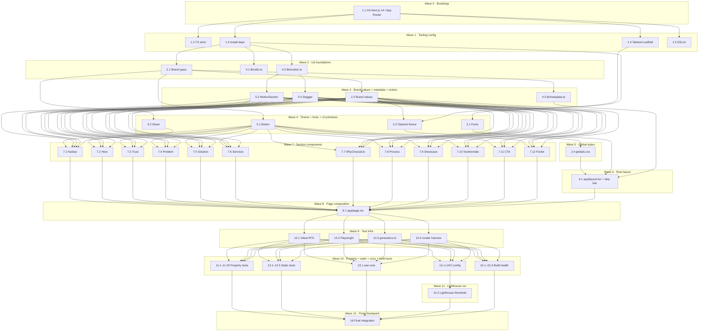

# Implementation Plan: compro-fix-landing-page (Atap Kreatif Manajemen Landing Page)

## Overview

Convert the design into a series of small, testable, self-contained prompts for a code-generation LLM that will implement each step with incremental progress.

The project is a single-page Next.js 14 (App Router) marketing site for **Atap Kreatif Manajemen**. Implementation language is **TypeScript (strict)**, styled with Tailwind CSS, animated with Framer Motion, and tested with Vitest + Playwright + fast-check (PBT) + axe-core + Lighthouse CI. All brand-specific content lives in `lib/brand.ts` (single source of truth per Requirement 2). The page composes twelve `<section>`s in this DOM order: Navbar → Hero → Trust → Problem → Solution → Services → WhyChooseUs → Process → Showcase → Testimonials → CTA → Footer (Requirement 1.1).

Each task references its specific Requirement and Property IDs, ends with a "Done when" definition, and builds on its declared dependencies — there is no orphaned code.

> **File-naming reconciliation (Req 12.1).** The ten filenames mandated by Requirement 12.1 (`Navbar.tsx, Hero.tsx, Problem.tsx, Solution.tsx, Services.tsx, Process.tsx, Showcase.tsx, Testimonials.tsx, CTA.tsx, Footer.tsx`) are preserved exactly. `Trust.tsx` and `WhyChooseUs.tsx` are added as supplementary section files required by Requirements 1.1, 14.1–14.2, and 16.6. Section ordering follows Requirement 1.1 (which includes Trust and WhyChooseUs); page-composition file imports are listed in the order required by Requirement 12.4 plus the two supplementary sections.

## Task Dependency Graph (Mermaid)



## Tasks

- [x] 1. Bootstrap the Next.js 14 project and tooling
  - [x] 1.1 Initialize Next.js 14 App Router project with TypeScript
    - Run `npx create-next-app@latest new-compro-atap --typescript --tailwind --app --eslint --src-dir=false --import-alias "@/*"` in the workspace root (or migrate the existing root if already scaffolded).
    - Ensure resulting tree has `app/`, `components/`, `lib/`, `public/`, `tsconfig.json`, `package.json`, `next.config.mjs`, `tailwind.config.ts`, `postcss.config.js`.
    - Remove example boilerplate (`app/page.tsx` Vercel demo, default `globals.css` content beyond Tailwind directives, default favicon copy).
    - **Done when:** `npx next info` runs without error, `package.json` lists `next@^14`, `react@^18`, `typescript@^5`.
    - _Requirements: 12.4, 13.1_

  - [x] 1.2 Configure `tsconfig.json` for strict TypeScript
    - Set `compilerOptions.strict: true`, `noImplicitAny: true`, `noUnusedLocals: true`, `noUnusedParameters: true`, `forceConsistentCasingInFileNames: true`.
    - Confirm `paths` alias `"@/*": ["./*"]`.
    - **Done when:** `npx tsc --noEmit` exits 0; the file contains no `// @ts-ignore` or `// @ts-nocheck`.
    - _Requirements: 12.3, 13.1_
    - _Depends on: 1.1_

  - [x] 1.3 Install runtime and dev dependencies
    - Runtime: `framer-motion`, `lucide-react`, `clsx`, `tailwind-merge`.
    - Dev: `vitest`, `@vitest/ui`, `@testing-library/react`, `@testing-library/jest-dom`, `@testing-library/user-event`, `jsdom`, `fast-check`, `@playwright/test`, `@axe-core/playwright`, `@lhci/cli`, `eslint-config-next`, `prettier`, `prettier-plugin-tailwindcss`.
    - Pin all versions to exact (no `^` / `~`) per safety_guardrails.
    - **Done when:** `npm install` exits 0 and `node_modules/framer-motion/package.json` exists.
    - _Requirements: 7.1, 9.6, 13.2_
    - _Depends on: 1.1_

  - [x] 1.4 Configure Tailwind scaffold
    - In `tailwind.config.ts`, set `content: ["./app/**/*.{ts,tsx}", "./components/**/*.{ts,tsx}", "./lib/**/*.ts"]`. Leave `theme.extend` empty for now (filled in 2.3).
    - Confirm `postcss.config.js` includes `tailwindcss` and `autoprefixer`.
    - **Done when:** the file compiles and `npm run build` does not error on missing Tailwind config.
    - _Requirements: 11.7, 18.2_
    - _Depends on: 1.1_

  - [x] 1.5 Configure ESLint at error-only severity
    - Use `eslint.config.mjs` extending `next/core-web-vitals`. Disable severity-`warn` rules that would block error-only enforcement; promote `@typescript-eslint/no-explicit-any` and `@typescript-eslint/ban-ts-comment` to `error`.
    - **Done when:** `npx next lint` exits 0 against the empty project.
    - _Requirements: 13.2_
    - _Depends on: 1.1_

- [x] 2. Implement Brand_Config and theme integration
  - [x] 2.1 Define Brand TypeScript schema in `lib/brand.ts`
    - Declare every interface from the design "Data Models" section: `Locale`, `NavItem`, `CtaConfig`, `ServiceConfig`, `WorkflowStep`, `DistributionStat`, `KolStat`, `ContactInfo`, `SocialLink`, `BrandColors`, `BrandFonts`, `BrandAssets`, `SeoConfig`, `TestimonialEntry`, `ShowcaseEntry`, `Brand`.
    - Export every type as a named export. No `any`. No fields typed as `unknown` without a narrower union.
    - **Done when:** the file compiles, exports `type Brand`, and a deliberate type-error stub (`const _x: Brand = {} as never`) is rejected by `tsc`.
    - _Requirements: 2.1, 12.2, 12.3_
    - _Depends on: 1.3_

  - [x] 2.2 Populate the `brand` constant with concrete values
    - Implement `export const brand: Brand` using the values shown in design "Concrete values" block: `name = "Atap Kreatif Manajemen"`, `wordmark = "ATAP KREATIF"`, locale `id-ID`, `colors.primary = "#1F2C43"`, `colors.accent = "#7E8772"`, `colors.background = "#DCD7D4"`, six services in canonical order (Buzzer Distribution, Content Clipping, Talent Management, Digital Advertising, Development, Creative Production), four workflow steps (Initial, Preparation, Execution, Reporting), six distribution rows, five KOL rows including Mega = `"menyusul"`, contact email/whatsapp/address as specified.
    - For every field that has no Source_Doc value yet (`tagline`, individual service `summary`/`items`, individual `whyChooseUs.description`, social, testimonials, showcase, `assets.logoSvg`, `assets.ogImage`, `assets.heroVisual`, `seo.siteUrl`), emit a comment of the exact form `// TODO(brand): brand.<path> — <one-line description>` (Requirement 10.5 case-sensitive prefix). Do not invent copy.
    - **Done when:** `import { brand } from "@/lib/brand"` type-checks, `brand.distributionDatabase.length === 6`, `brand.workflow.length === 4`, `brand.services.length === 6`, `brand.kolDatabase.find(k => k.tier.toLowerCase().includes("mega"))?.count === "menyusul"`, and `grep -c "TODO(brand):" lib/brand.ts` returns one match per cleared field.
    - _Requirements: 2.1, 10.5, 10.6, 14.1, 14.2, 16.4, 16.5, 16.6, 16.7, 18.1_
    - _Depends on: 2.1_

  - [x] 2.3 Wire Brand_Config tokens into Tailwind theme
    - Edit `tailwind.config.ts` to import `{ brand }` from `./lib/brand` and set `theme.extend.colors = { primary: brand.colors.primary, accent: brand.colors.accent, background: brand.colors.background, foreground: brand.colors.foreground, muted: brand.colors.muted }`.
    - Set `theme.extend.fontFamily.display = ["var(--font-display)", "system-ui", "sans-serif"]` and `theme.extend.fontFamily.body = ["var(--font-body)", "Helvetica", '"Helvetica Neue"', "Arial", "system-ui", "sans-serif"]`.
    - Set `theme.extend.borderRadius = { sm: "0.25rem", md: "0.5rem", lg: "1rem" }` (max three keys; largest ≤ 1rem).
    - **Done when:** `npm run build` produces a `.next/` bundle that includes a class `bg-primary` resolving to `#1F2C43`, and `theme.extend.borderRadius` has exactly three entries.
    - _Requirements: 2.5, 11.4, 11.7, 18.1, 18.2, 18.11_
    - _Depends on: 2.2, 1.4_

  - [x] 2.4 Implement `app/globals.css` with Tailwind base + body defaults
    - Add `@tailwind base; @tailwind components; @tailwind utilities;` at the top.
    - Add a `:root` block exposing `--font-display` and `--font-body` variables (set later by `next/font`).
    - Add `html, body { background-color: theme(colors.background); color: theme(colors.foreground); }` so the brand background is the page default with ≥ 9:1 contrast (Req 18.7).
    - Add a `.skip-link` utility: visually-hidden by default, reveals on `:focus` with a visible focus ring.
    - **Done when:** the file compiles, `getComputedStyle(document.body).backgroundColor` resolves to `rgb(220, 215, 212)` in JSDOM tests.
    - _Requirements: 6.5, 18.1, 18.2, 18.7_
    - _Depends on: 2.3_

- [x] 3. Configure fonts (Poppins + Helvetica fallback)
  - [x] 3.1 Implement `lib/fonts.ts` exposing `fontDisplay` and `fontBody`
    - Use `next/font/google` to load `Poppins` with `weight: ['400', '600', '700']`, `style: ['normal', 'italic']`, `subsets: ['latin']`, `display: 'swap'`, `variable: '--font-display'`.
    - Use `next/font/local` for Helvetica with `src: [{ path: '../public/fonts/helvetica/Helvetica.woff2', weight: '400', style: 'normal' }]` *only if* the file exists at runtime; otherwise export a sentinel object that resolves to no className but still emits the `--font-body` CSS variable from the fallback stack.
    - Provide a small synchronous filesystem check (`fs.existsSync`) at module init or expose a constant `HELVETICA_LOCAL_AVAILABLE: boolean`. Do **not** emit a `TODO(brand):` for the fallback path (Req 18.4 explicitly approves it).
    - **Done when:** `import { fontDisplay, fontBody } from "@/lib/fonts"` returns `{ variable, className }` shapes; `fontDisplay.variable === "--font-display"`.
    - _Requirements: 9.6, 11.1, 11.2, 18.3, 18.4_
    - _Depends on: 1.3_

- [x] 4. Implement shared library modules
  - [x] 4.1 Implement `lib/utils.ts` helpers
    - Export `cn(...inputs: ClassValue[]): string` using `clsx` + `tailwind-merge`.
    - Export `nonEmpty(value: string | undefined | null): string | null` returning `null` if value is `undefined`, `null`, or `value.trim() === ""`.
    - Export `buildWhatsAppHref(displayNumber: string): string` that strips non-digits, prefixes with `62` if it starts with `0`, and returns `https://wa.me/${e164}`. Example: `buildWhatsAppHref("0812-5892-2216") === "https://wa.me/6281258922216"`.
    - Export `formatYear(override?: number): number` returning `override ?? new Date().getFullYear()`.
    - **Done when:** `tsc` passes; concrete unit tests in 10.1 will exercise these.
    - _Requirements: 4.5, 15.4, 15.5, 15.6, 2.4_
    - _Depends on: 1.3_

  - [x] 4.2 Implement `lib/motion.ts` Framer Motion variants
    - Export `fadeUp`, `fadeIn`, `scaleIn` variant objects with `transition.duration ≤ 0.6` (≤ 600ms entrance per Req 7.3) and `ease: "easeOut"`.
    - Export `stagger(delay = 0.06)` factory returning a parent variant whose `transition.staggerChildren = delay`.
    - Export shared `MICRO_TRANSITION_MS = 250` and `ENTRANCE_TRANSITION_MS = 600` constants used by Property 14 tests.
    - **Done when:** every variant's `visible.transition.duration ≤ 0.6`; constants are importable.
    - _Requirements: 7.1, 7.3, 7.5_
    - _Depends on: 1.3_

  - [x] 4.3 Implement `lib/metadata.ts` `buildMetadata()`
    - Function signature: `export function buildMetadata(): Metadata`.
    - Title: `brand.seo.title || \`${brand.name} — ${brand.tagline}\``, truncated to 60 chars, with a 10-char minimum invariant.
    - Description: `brand.seo.description || brand.description.slice(0, 160)`, with a 50–160 char invariant.
    - `openGraph`: include `title`, `description`, `siteName: brand.name`, `locale: brand.locale`, `type: "website"`. Conditionally add `url` only when `brand.seo.siteUrl` is truthy. Conditionally add `images` only when `brand.assets.ogImage` is truthy.
    - `twitter`: `{ card: "summary_large_image", title, description }`.
    - `alternates.canonical`: present iff `brand.seo.siteUrl` is truthy.
    - At top of file emit `// TODO(brand): brand.assets.ogImage — supply OpenGraph image` when the asset is undefined (Req 8.6).
    - **Done when:** with the canonical brand, `buildMetadata().title.length` is between 10 and 60; `buildMetadata().alternates` is `undefined`; `buildMetadata().openGraph?.images` is `undefined`; `buildMetadata().twitter?.card === "summary_large_image"`.
    - _Requirements: 8.1, 8.3, 8.4, 8.5, 8.6, 8.7_
    - _Depends on: 2.1_

- [x] 5. Implement shared UI primitives and motion wrappers
  - [x] 5.1 Implement `components/ui/Button.tsx`
    - Props: `{ variant?: "primary" | "secondary" | "ghost"; href?: string; ariaLabel?: string; children: React.ReactNode; className?: string }`.
    - Render `<a>` when `href` is present, otherwise `<button type="button">`.
    - Apply `min-h-11 min-w-11 px-5 py-3` to guarantee 44×44 hit target across viewports (Req 4.1–4.4, 5.8).
    - Apply `focus-visible:outline focus-visible:outline-2 focus-visible:outline-offset-2 focus-visible:outline-accent` for the focus ring (Req 6.5).
    - Variant styles: `primary` → `bg-primary text-background hover:bg-primary/90`; `secondary` → `border border-primary text-primary hover:bg-primary/10`; `ghost` → `text-primary hover:bg-primary/5`.
    - Hover/focus transitions ≤ 250ms via `transition-colors duration-200` (Req 7.5).
    - No hex literals in source (Req 11.7, 11.8).
    - **Done when:** RTL renders with `min-h: 44px`, focus ring present on tab, no hex literal in the file.
    - _Requirements: 4.1, 4.2, 4.3, 4.4, 5.8, 6.5, 7.5, 11.7, 11.8_
    - _Depends on: 2.1_

  - [x] 5.2 Implement `components/ui/Sheet.tsx` (mobile menu primitive)
    - Implement a controlled `Sheet` overlay using Framer Motion `<AnimatePresence>` with `fade + slide` variant; toggle prop `open: boolean`, `onOpenChange: (open: boolean) => void`.
    - Open/close transition completes in ≤ 300 ms (Req 5.7) and collapses to instant when `useReducedMotion()` is true (Req 7.4).
    - Trap focus within the sheet while open; first focusable on open is the sheet's close button; Esc closes. No keyboard traps (Req 6.8).
    - **Done when:** opening the sheet moves focus to the close button within one tick; `useReducedMotion()` mock collapses transition to 0 ms.
    - _Requirements: 5.7, 6.8, 7.4_
    - _Depends on: 2.1_

  - [x] 5.3 Implement `components/motion/MotionSection.tsx`
    - Client component (`"use client"`). Props `{ children: React.ReactNode; variants?: Variants; className?: string; as?: ElementType }` defaulting `as="section"` and `variants={fadeUp}`.
    - Use `useInView({ amount: 0.25, once: true })` and `useReducedMotion()`. When reduced motion is on, render with `initial={false}` so the children appear in their final state (Req 7.4).
    - **Done when:** with `prefers-reduced-motion: reduce` mocked, the rendered element has `style.opacity === "1"` on first paint and zero `transition-duration`.
    - _Requirements: 6.7, 7.3, 7.4_
    - _Depends on: 4.2_

  - [x] 5.4 Implement `components/motion/Stagger.tsx`
    - Client component wrapping children in `motion.div` with `variants={stagger(delay)}`, `initial="hidden"`, `whileInView="visible"`, `viewport={{ amount: 0.25, once: true }}`.
    - Default stagger delay = 0.06s; configurable via `delay` prop.
    - Reduced-motion: collapse to instant (consult `useReducedMotion()`).
    - **Done when:** rendering ten children with default delay produces total animation time ≤ 600 ms (Req 7.3) or 0 under reduced motion.
    - _Requirements: 7.1, 7.3, 7.4_
    - _Depends on: 4.2_

- [x] 6. Root layout and skip link
  - [x] 6.1 Implement `app/layout.tsx`
    - Set `<html lang={brand.locale.split("-")[0]}>` so `id-ID → "id"`, `en → "en"` (Req 6.1, 17.4).
    - Apply font CSS variables: `<body className={cn(fontDisplay.variable, fontBody.variable, "bg-background text-foreground font-body antialiased")}>`.
    - Render the skip-link as the first focusable child of `<body>`: `<a href="#main-content" className="skip-link">Skip to main content</a>` (Req 6.3).
    - Export `metadata = buildMetadata()` from `lib/metadata.ts`.
    - Export `viewport = { width: "device-width", initialScale: 1 }` per Next.js App Router viewport export (Req 8.5).
    - Wrap `{children}` in a Framer Motion `<MotionConfig reducedMotion="user">` so reduced-motion preference flows globally (Req 6.7, 7.4).
    - **Done when:** rendered HTML has exactly one `<html lang>`, one `.skip-link` as first focusable, `metadata.title` matches Brand_Config; `next dev` boots without console errors.
    - _Requirements: 1.2, 1.3, 6.1, 6.3, 6.7, 7.4, 8.1, 8.5, 17.4_
    - _Depends on: 2.4, 3.1, 4.3_

- [x] 7. Implement Section_Components (one file per section under `components/`)
  - [x] 7.1 Implement `components/Navbar.tsx`
    - Default-exported function component. Props per design `NavbarProps`.
    - Sticky top bar (`h-16 md:h-20`, `bg-background/80 backdrop-blur`).
    - Desktop ≥ 768 px: render nav row inline + Primary_CTA on the right (Req 5.3); hide mobile trigger.
    - Mobile ≤ 767 px: render burger trigger (44×44 target via Button) opening `<Sheet>` (5.2) containing nav links and Primary_CTA (Req 5.2, 4.2).
    - Logo: render `` if provided; else typographic fallback `<span class="font-display font-bold text-primary">ATAP KREATIF</span>` plus a `// TODO(brand): Navbar — missing brand.assets.logoSvg` comment immediately above the JSX (Req 18.6, 10.1).
    - All brand-specific text comes from props — zero hardcoded brand literals (Req 2.6, 11.7, 11.8).
    - **Done when:** RTL test at width 360 shows mobile trigger and hides desktop nav; at width 1280 shows desktop nav and hides trigger; Primary_CTA href equals `brand.primaryCta.href`.
    - _Requirements: 1.2, 1.4, 2.3, 2.6, 4.1, 4.2, 4.5, 5.2, 5.3, 5.7, 6.5, 11.7, 11.8, 18.5, 18.6_
    - _Depends on: 2.2, 5.1, 5.2, 5.3, 5.4_

  - [x] 7.2 Implement `components/Hero.tsx`
    - Default-exported function component. Props per design `HeroProps`.
    - Render headline as the **single** `<h1>` of the page (Req 3.4, 6.2, 8.2). Headline length validation must be enforced at type level (`string`) and runtime fallback per Req 1.5 if empty.
    - Render eyebrow (`text-xs uppercase tracking-[0.2em] text-accent`), paragraph (`max-w-prose`), Primary_CTA, Secondary_CTA (Req 3.1, 4.3).
    - Tab order: Primary_CTA appears in DOM before Secondary_CTA, and both appear after Navbar interactives (Req 3.5).
    - Visual: when `visual` prop provided, render `<Image>` with explicit `width`/`height` and `priority`; on `onError`, swap to a token-styled placeholder div with the same dimensions (Req 13.4, 9.5). When `visual` absent, render the typographic poster fallback (Req 18.10).
    - All four content elements remain inside the viewport at 320–1920 px (Req 3.6, 5.1).
    - Wrap entrance in `<MotionSection>` with the headline using a stagger (Req 7.3).
    - **Done when:** exactly one `<h1>`; both CTAs reach hrefs from `brand.primaryCta`/`brand.secondaryCta`; image fallback test does not emit broken-image indicator.
    - _Requirements: 3.1, 3.2, 3.3, 3.4, 3.5, 3.6, 3.7, 3.8, 4.3, 4.5, 5.1, 7.3, 8.2, 9.5, 13.4, 18.10_
    - _Depends on: 2.2, 5.1, 5.3, 5.4_

  - [x] 7.3 Implement `components/Trust.tsx`
    - Default-exported function component. Props per design `TrustProps` (`distribution[]`, `kol[]`).
    - Two stacked groups under one `<h2>`. Render six distribution stat cards and four-or-five KOL stat cards (Req 14.1, 14.2).
    - For any KOL entry whose `count === "menyusul"`, render the tier label and the italic `"menyusul"` note in `text-accent`; do **not** render any digit `0-9` inside that card's DOM subtree (Req 10.6, Property 10).
    - Card classes use only token utilities (`bg-primary/5 border-primary/10 text-primary`) — no hex literals (Req 11.7, 11.8).
    - Wrap in `<Stagger delay={0.04}>`.
    - **Done when:** RTL test asserts six distribution cards, four numeric KOL cards, exactly one "menyusul" card with no digit.
    - _Requirements: 1.4, 5.4, 5.6, 7.3, 10.6, 11.7, 14.1, 14.2, 14.6, 18.8_
    - _Depends on: 2.2, 5.3, 5.4_

  - [x] 7.4 Implement `components/Problem.tsx`
    - Default-exported function component. Props `{ heading, body, eyebrow?, accentImage? }`.
    - Two-column editorial layout on desktop (heading left, body+image right); single column on mobile (Req 5.4, 5.6).
    - Heading uses `<h2>` referenced by parent `<section aria-labelledby>` (Req 1.4).
    - All copy paraphrases Source_Doc fragmented-execution framing; no fabricated competitor or client claims (Req 16.2, 16.9).
    - Wrap in `<MotionSection>`.
    - **Done when:** RTL test asserts the heading is `<h2>`, body length ∈ [1, 400], no fabricated trademarked competitor names.
    - _Requirements: 1.4, 5.4, 5.6, 7.3, 16.2, 16.9_
    - _Depends on: 2.2, 5.3_

  - [x] 7.5 Implement `components/Solution.tsx`
    - Default-exported function component. Props per design `SolutionProps` (`pillars[]` 4–6).
    - Asymmetric 6-column bento grid on desktop; 2-column on tablet; 1-column on mobile (Req 5.4, 5.6).
    - Hero card uses `bg-primary text-background`; smaller cards `bg-background border border-primary/15`; icons in `text-accent` (Req 18.8).
    - Cards use `rounded-md` only (≤ 1rem) — no `rounded-xl` etc. (Req 11.4, 18.11).
    - Stagger entrance with `scaleIn` variant (Req 7.3).
    - Source_Doc traceability: copy describes integrated digital ecosystem combining the six service families (Req 16.3).
    - **Done when:** desktop renders ≥ 5 cards (1 hero + 4–6 pillars); rounded-radius classes are within `{rounded-sm, rounded-md, rounded-lg}`.
    - _Requirements: 1.4, 5.4, 5.6, 7.3, 11.4, 16.3, 18.8, 18.11_
    - _Depends on: 2.2, 5.3, 5.4_

  - [x] 7.6 Implement `components/Services.tsx`
    - Default-exported function component. Props per design `ServicesProps` (`services[]` length 6).
    - Render six cards in canonical order matching `brand.services` (Req 16.4). Each card shows numerical marker `01`–`06` in `text-accent`, title, summary, bullet list (`<ul role="list">`).
    - Layout `grid-cols-1 md:grid-cols-2 lg:grid-cols-3` (Req 5.6).
    - Each summary `length ∈ [80, 280]`; each `items.length ∈ [3, 8]` (Req 16.5). When a service entry has missing summary or fewer than 3 items, render the structural placeholder for that card and emit `// TODO(brand): Services — missing brand.services[<id>].summary` (Req 1.5, 10.4).
    - Stagger fade-in with 50 ms stagger (Req 7.3).
    - **Done when:** canonical brand renders six cards with titles in the canonical order; mutated brand with one cleared `summary` renders a placeholder card and emits one `TODO(brand):` comment.
    - _Requirements: 1.4, 1.5, 5.6, 7.3, 10.4, 10.5, 16.4, 16.5_
    - _Depends on: 2.2, 5.3, 5.4_

  - [x] 7.7 Implement `components/WhyChooseUs.tsx`
    - Default-exported function component. Props per design `WhyChooseUsProps` (`reasons[]` length 3–5).
    - Render numbered list with large `text-accent` numerals; `grid-cols-[auto_1fr] gap-8` on desktop, single column on mobile.
    - Reasons MUST collectively include the four canonical themes (case-insensitive substring): `integrated digital ecosystem`, `community-based activation`, `adaptive campaign strategies`, `measurable workflows` (Req 16.6, Property 15).
    - Wrap in `<Stagger>`.
    - **Done when:** the four canonical themes appear as substrings in the rendered DOM text under the section.
    - _Requirements: 1.4, 5.4, 5.6, 7.3, 16.6_
    - _Depends on: 2.2, 5.3, 5.4_

  - [x] 7.8 Implement `components/Process.tsx`
    - Default-exported function component. Props per design `ProcessProps` (`steps[]` length 4).
    - Desktop: horizontal 4-column timeline with thin `border-accent` connector; tablet: 2×2; mobile: vertical timeline (Req 5.4, 5.6).
    - Step titles MUST equal `["Initial", "Preparation", "Execution", "Reporting"]` in order (Req 16.7, Property 15).
    - Connector draws (`scaleX 0 → 1`, ≤ 600ms) on view; reduced-motion renders fully drawn (Req 7.3, 7.4).
    - **Done when:** four cards rendered in order; reduced-motion mock yields `transition-duration: 0ms` on the connector.
    - _Requirements: 1.4, 5.4, 5.6, 6.7, 7.3, 7.4, 16.7_
    - _Depends on: 2.2, 5.3, 5.4_

  - [x] 7.9 Implement `components/Showcase.tsx`
    - Default-exported function component. Props per design `ShowcaseProps`.
    - Render asymmetric grid of `entries`. For each entry, `<Image>` with explicit `width`/`height` and an `onError` swap to token placeholder (Req 9.5, 13.4).
    - When `entries.length === 0`, render exactly 3 `aspect-[4/5] bg-primary/5 border border-primary/10 rounded-md` placeholder slots and emit `// TODO(brand): Showcase — missing brand.showcase entries` (Req 10.3, 10.5).
    - Hover micro-interaction on linked tiles: `image scale 1 → 1.02` over 250 ms (Req 7.5).
    - All radii within the 3-token scale (Req 11.4, 18.11).
    - **Done when:** empty-entries render produces 3 placeholder tiles; populated render produces N tiles equal to `entries.length`.
    - _Requirements: 1.4, 1.5, 5.6, 7.3, 7.5, 9.5, 10.3, 10.5, 11.4, 13.4, 18.9, 18.11_
    - _Depends on: 2.2, 5.3, 5.4_

  - [x] 7.10 Implement `components/Testimonials.tsx`
    - Default-exported function component. Props per design `TestimonialsProps`.
    - Filter rule: omit any entry missing `quote`, `name`, or `role` entirely (Req 14.5, Property 15). The count of rendered cards equals the count of complete entries.
    - When `entries.length === 0` (or all filtered out), render exactly 3 placeholder cards with skeleton lines (`bg-primary/10`) and emit `// TODO(brand): Testimonials — missing brand.testimonials entries` (Req 10.2, 10.5). No fabricated names, quotes, or companies (Req 14.7, 16.9, Property 19).
    - Each rendered entry: opening-quote glyph (`aria-hidden="true"`), italicized quote, attribution `— Name, Role`.
    - **Done when:** mutated brand with one entry missing `role` renders zero cards and emits one `TODO(brand):` comment; canonical brand with two complete entries renders two cards.
    - _Requirements: 1.4, 1.5, 7.3, 10.2, 10.4, 10.5, 14.3, 14.4, 14.5, 14.7, 16.9_
    - _Depends on: 2.2, 5.3, 5.4_

  - [x] 7.11 Implement `components/CTA.tsx`
    - Default-exported function component. Props per design `CtaProps`.
    - Full-bleed band with `bg-primary text-background`. Centered heading + body + Primary_CTA + Secondary_CTA.
    - Primary_CTA label and href MUST be byte-equal to `brand.primaryCta` and identical to the Hero/Navbar instances (Req 2.3, 4.5, Property 4).
    - Mobile: stacked CTAs; tablet+: side-by-side (Req 5.4).
    - **Done when:** rendered Primary_CTA `href` and `label` equal `brand.primaryCta.{href,label}` exactly across all three render sites.
    - _Requirements: 1.4, 2.3, 4.4, 4.5, 5.4, 7.3, 16.8_
    - _Depends on: 2.2, 5.1, 5.3_

  - [x] 7.12 Implement `components/Footer.tsx`
    - Default-exported function component. Props per design `FooterProps`.
    - 4-column grid on desktop (brand · nav · contact · social); stacked on mobile.
    - Email rendered as `<a href="mailto:...">` with non-empty `aria-label` (Req 15.3).
    - WhatsApp rendered as `<a href={buildWhatsAppHref(contact.whatsapp)}>` with `aria-label="Chat Atap Kreatif on WhatsApp"` (Req 15.4).
    - Year: `formatYear(yearOverride)` (Req 15.5, 15.6).
    - Social block: when `social.length === 0`, omit the entire group (Req 15.7); when `≥ 1`, every link has a non-empty Accessible_Name (Req 15.8).
    - Logo fallback identical to Navbar (typographic + `TODO(brand)` comment) (Req 18.6).
    - Surface: `bg-primary text-background`.
    - **Done when:** Footer with `social = []` renders no social group; with `social = [{...}]` renders the group; year matches `Date.now()` year unless override given.
    - _Requirements: 1.2, 1.4, 4.5, 15.1, 15.2, 15.3, 15.4, 15.5, 15.6, 15.7, 15.8, 18.6_
    - _Depends on: 2.2, 4.1, 5.1, 5.3_

- [x] 8. Compose the page
  - [x] 8.1 Implement `app/page.tsx`
    - Server Component. Import `{ brand }` from `@/lib/brand`. Render in this exact DOM order, each as `<section aria-labelledby="...">` with a unique heading id (Req 1.1, 1.4):
      1. `<header>` containing `<Navbar ... />`
      2. `<main id="main-content">` containing `<Hero/>, <Trust/>, <Problem/>, <Solution/>, <Services/>, <WhyChooseUs/>, <Process/>, <Showcase/>, <Testimonials/>, <CTA/>`
      3. `<footer>` containing `<Footer ... />`
    - Pass each section the relevant slice of `brand` as props rather than letting sections import `brand` directly (so unit tests can pass partial fixtures; Req 1.6, 10.4).
    - Each section's heading id must be unique on the page (Req 1.4).
    - **Done when:** rendered DOM has exactly one `<header>`, one `<main>`, one `<footer>`; the twelve sections appear in the order above; no section imports `lib/brand.ts` directly except `page.tsx` and `layout.tsx`.
    - _Requirements: 1.1, 1.2, 1.3, 1.4, 1.6, 12.4_
    - _Depends on: 6.1, 7.1, 7.2, 7.3, 7.4, 7.5, 7.6, 7.7, 7.8, 7.9, 7.10, 7.11, 7.12_

- [x] 9. Checkpoint - dev build runs cleanly
  - Ensure `npm run build` exits 0 with zero TS errors and `npm run dev` boots with no React hydration warnings. Visit `http://localhost:3000` once, scroll the full page, confirm the twelve sections render in order. Ensure all tests pass, ask the user if questions arise.

- [ ] 10. Test infrastructure setup
  - [x] 10.1 Configure Vitest + React Testing Library + JSDOM
    - Add `vitest.config.ts` with `environment: "jsdom"`, `setupFiles: ["tests/setup.ts"]`, `globals: true`. In `tests/setup.ts` import `@testing-library/jest-dom`.
    - Add `npm` scripts: `"test": "vitest --run"`, `"test:watch": "vitest"`.
    - **Done when:** `npm run test -- tests/sanity.test.ts` (a smoke `expect(1).toBe(1)`) exits 0.
    - _Requirements: 13.3_
    - _Depends on: 8.1_

  - [x] 10.2 Configure Playwright
    - Add `playwright.config.ts` with `projects: [{ name: "chromium", use: devices["Desktop Chrome"] }, { name: "mobile", use: devices["Pixel 5"] }]`, `webServer: { command: "npm run start", port: 3000, reuseExistingServer: !process.env.CI }`.
    - Add `npm run test:e2e` → `playwright test`.
    - **Done when:** `npx playwright test --list` enumerates project configs without error.
    - _Requirements: 9.1, 13.3_
    - _Depends on: 8.1_

  - [ ] 10.3 Implement `tests/generators.ts` fast-check arbitraries
    - Export `arbBrand: fc.Arbitrary<Brand>` producing brands with valid shapes (services length 6, workflow length 4, distribution length 6, KOL length 4–5, locale ∈ {`id-ID`,`en`}, hex colors matching `/^#[0-9A-F]{6}$/i`, contact strings).
    - Export `arbBrandWithCleared(fields: BrandFieldPath[]): fc.Arbitrary<Brand>` clearing fields per Property 9.
    - Export `arbViewportWidth = fc.integer({ min: 320, max: 1920 })` plus boundary biasing via `fc.oneof(fc.constantFrom(320, 374, 768, 1024, 1280, 1920), fc.integer({ min: 320, max: 1920 }))`.
    - Export `arbReducedMotion = fc.boolean()` and `arbLocale = fc.constantFrom("id-ID", "en")`.
    - Export `arbFailingImageSrc = fc.constant("/intentionally-missing.jpg")`.
    - **Done when:** `fc.sample(arbBrand, 5).every(b => b.services.length === 6)` is true.
    - _Requirements: all property requirements (used by 11.1–11.20)_
    - _Depends on: 8.1_

  - [ ] 10.4 Implement `tests/render.tsx` harness
    - Export `renderPage(brand: Brand, opts?: { viewport?: number; reducedMotion?: boolean })` that mocks `window.matchMedia` for reduced-motion and `window.innerWidth` for viewport, then renders `<RootLayout><HomePage brand={brand} /></RootLayout>` via RTL into JSDOM.
    - Export `renderInBrowser(brand: Brand, page: PlaywrightPage)` for E2E property tests that need real layout (used by Properties 5, 7, 11, 12, 13, 14).
    - **Done when:** smoke test renders the canonical brand and finds exactly one `<h1>`.
    - _Requirements: 1.1, 1.2, 1.3_
    - _Depends on: 8.1_

- [ ] 11. Property-based tests (one task per Property; one test file each)
  - [ ] 11.1 Property 1 — Page structure and landmark integrity
    - File `tests/properties/structure.test.ts`. Generators: `arbBrand`. ≥ 100 iterations.
    - Assert: exactly one `<header>`, one `<main>`, one `<footer>`; twelve sections in DOM order Navbar→Footer; each `<section>` has `aria-labelledby` referencing an existing non-empty heading; all referenced labels unique.
    - **Validates: Requirements 1.1, 1.2, 1.3, 1.4, 12.4. Property 1.**
    - _Depends on: 10.1, 10.3, 10.4_

  - [ ] 11.2 Property 2 — Heading hierarchy with single h1
    - File `tests/properties/headings.test.ts`. Generators: `arbBrand`. ≥ 100 iterations.
    - Assert: exactly one `<h1>` inside Hero; sequence of heading levels never increases by > 1 between consecutive headings.
    - **Validates: Requirements 3.4, 6.2, 8.2. Property 2.**
    - _Depends on: 10.1, 10.3, 10.4_

  - [ ] 11.3 Property 3 — Skip link first focusable + lands focus on `<main>`
    - File `tests/properties/skip-link.test.ts`. Generators: `arbBrand × arbViewportWidth`. ≥ 100 iterations.
    - Assert: first tabbable element is the skip link; activation moves focus to `<main>`; the next four tab stops include all Navbar interactives followed by Hero Primary_CTA then Hero Secondary_CTA in that order.
    - **Validates: Requirements 3.5, 6.3. Property 3.**
    - _Depends on: 10.1, 10.3, 10.4_

  - [ ] 11.4 Property 4 — Primary_CTA identity is byte-equal across render sites
    - File `tests/properties/cta-identity.test.ts`. Generators: `arbBrand`. ≥ 100 iterations.
    - Assert: Navbar, Hero, and CTA_Section render `brand.primaryCta.label` and `brand.primaryCta.href` byte-equal; Hero and CTA_Section render `brand.secondaryCta` byte-equal.
    - **Validates: Requirements 2.3, 4.5, 16.8. Property 4.**
    - _Depends on: 10.1, 10.3, 10.4_

  - [ ] 11.5 Property 5 — Hit target floor for all interactive controls
    - File `tests/properties/hit-target.test.ts`. Generators: `arbBrand × arbViewportWidth`. Run via Playwright (`renderInBrowser`). ≥ 50 iterations.
    - Assert: every visible interactive control has `getBoundingClientRect()` width ≥ 44 and height ≥ 44.
    - **Validates: Requirements 4.1, 4.2, 4.3, 4.4, 5.8. Property 5.**
    - _Depends on: 10.2, 10.3, 10.4_

  - [ ] 11.6 Property 6 — CTA activation initiates navigation
    - File `tests/properties/cta-activation.test.ts`. Generators: `arbBrand`. ≥ 100 iterations.
    - Assert: clicking, tapping, Enter, and Space on each rendered CTA initiates navigation to the configured `href` within 1000 ms without throwing an uncaught exception.
    - **Validates: Requirements 3.7, 4.6. Property 6.**
    - _Depends on: 10.1, 10.3, 10.4_

  - [ ] 11.7 Property 7 — No horizontal scroll across viewport range
    - File `tests/properties/no-horizontal-scroll.test.ts`. Generators: `arbBrand × arbViewportWidth`. Playwright. ≥ 50 iterations.
    - Assert: `document.documentElement.scrollWidth ≤ viewportWidth`; every Hero descendant's bounding rect is fully within `[0, viewportWidth]`.
    - **Validates: Requirements 3.6, 5.1. Property 7.**
    - _Depends on: 10.2, 10.3, 10.4_

  - [ ] 11.8 Property 8 — Responsive Navbar and column-count discipline
    - File `tests/properties/responsive-navbar.test.ts`. Generators: `arbBrand × arbViewportWidth × arbReducedMotion`. Playwright. ≥ 50 iterations.
    - Assert: at width [320, 767] mobile trigger visible & desktop nav hidden, sections single-column; at [768, 1920] desktop nav visible & trigger hidden, sections with ≥ 3 items render ≥ 2 columns; mobile menu toggle completes ≤ 300 ms.
    - **Validates: Requirements 5.2, 5.3, 5.4, 5.6, 5.7. Property 8.**
    - _Depends on: 10.2, 10.3, 10.4_

  - [ ] 11.9 Property 9 — Missing-input fallback discipline
    - File `tests/properties/missing-input-fallback.test.ts`. Generators: `arbBrandWithCleared × arbFailingImageSrc`. ≥ 100 iterations.
    - Assert: every cleared field's consumer renders a placeholder; source contains exactly one `// TODO(brand):` comment per cleared field with the case-sensitive prefix; no `<a>` empty href, no `<li>` empty text, no `` broken indicator, no empty text node; twelve-section ordering preserved even with full clearing.
    - **Validates: Requirements 1.5, 1.6, 2.4, 4.7, 10.1, 10.2, 10.3, 10.4, 10.5, 13.4, 18.6. Property 9.**
    - _Depends on: 10.1, 10.3, 10.4_

  - [ ] 11.10 Property 10 — Mega KOL "menyusul" suppresses any numeric
    - File `tests/properties/menyusul.test.ts`. Generators: `arbBrand` biased to inject `count: "menyusul"`. ≥ 100 iterations.
    - Assert: for any KOL entry where `count === "menyusul"`, the rendered DOM subtree contains no character in `[0-9]` and no localized digit form.
    - **Validates: Requirements 10.6, 14.2 (menyusul clause). Property 10.**
    - _Depends on: 10.1, 10.3, 10.4_

  - [ ] 11.11 Property 11 — Typography discipline
    - File `tests/properties/typography.test.ts`. Generators: `arbBrand`. Playwright (computed style). ≥ 30 iterations.
    - Assert: every `<h1>`–`<h6>` resolves primary `font-family` to Poppins; every `<p>`/`<li>`/`<button>`/`<a>` text resolves primary `font-family` to body family; union of distinct primary families ≤ 2.
    - **Validates: Requirements 11.1, 11.2, 18.3. Property 11.**
    - _Depends on: 10.2, 10.3, 10.4_

  - [ ] 11.12 Property 12 — Color token propagation and restricted palette
    - File `tests/properties/color-tokens.test.ts`. Generators: `arbBrand`. Playwright. ≥ 30 iterations.
    - Assert: Tailwind resolved `colors.primary/accent/background/foreground` equal `brand.colors.*`; `<body>` resolves `background-color = #DCD7D4` and `color = #1F2C43` with measured contrast ≥ 9:1; descendants of Hero/Trust/Solution/CTA resolve color-bearing properties to the palette set with α ∈ (0,1].
    - **Validates: Requirements 2.5, 11.7, 18.1, 18.2, 18.7, 18.8. Property 12.**
    - _Depends on: 10.2, 10.3, 10.4_

  - [ ] 11.13 Property 13 — Reduced-motion honors the user preference
    - File `tests/properties/reduced-motion.test.ts`. Generators: `arbBrand` with forced `prefers-reduced-motion: reduce`. Playwright. ≥ 30 iterations.
    - Assert: every motion-decorated element resolves `animation-duration` and `transition-duration` to 0 ms; every motion-decorated element renders in final state on first paint (no animated intermediate); focus-indicator transitions excluded.
    - **Validates: Requirements 6.7, 7.4. Property 13.**
    - _Depends on: 10.2, 10.3, 10.4_

  - [ ] 11.14 Property 14 — Motion duration bounds when motion is allowed
    - File `tests/properties/motion-duration.test.ts`. Generators: `arbBrand` (no reduced motion). Playwright. ≥ 30 iterations.
    - Assert: every entrance animation completes ≤ 600 ms after the host crosses 25% visibility; every hover/focus micro-interaction completes ≤ 250 ms; no parallax / autoplaying carousel ≤ 6s / scroll-jacking / floating-blob keyframe.
    - **Validates: Requirements 7.1, 7.2, 7.3, 7.5. Property 14.**
    - _Depends on: 10.2, 10.3, 10.4_

  - [ ] 11.15 Property 15 — Source_Doc cardinality and bounds
    - File `tests/properties/source-doc-cardinality.test.ts`. Generators: `arbBrand`. ≥ 200 iterations.
    - Assert: `services.length === 6` with canonical title order; each summary length ∈ [80, 280]; each items length ∈ [3, 8]; `workflow.length === 4` with canonical titles; `distributionDatabase.length === 6` over canonical platforms with non-negative integers; `kolDatabase.length ∈ [4, 5]`; `whyChooseUs` covers four canonical themes; rendered testimonials count equals complete-entry count (no padding).
    - **Validates: Requirements 14.1, 14.3, 14.4, 14.5, 16.4, 16.5, 16.6, 16.7. Property 15.**
    - _Depends on: 10.1, 10.3, 10.4_

  - [ ] 11.16 Property 16 — Locale consistency
    - File `tests/properties/locale.test.ts`. Generators: `arbBrand × arbLocale`. ≥ 100 iterations.
    - Assert: `<html lang>` is a valid BCP 47 tag whose primary subtag equals `brand.locale.split("-")[0]`; dominant language of rendered text matches that primary subtag with proper-noun and `menyusul` exceptions.
    - **Validates: Requirements 6.1, 17.1, 17.3, 17.4. Property 16.**
    - _Depends on: 10.1, 10.3, 10.4_

  - [ ] 11.17 Property 17 — Metadata construction is total and never fabricates assets
    - File `tests/properties/metadata.test.ts`. Generators: `arbBrand`. ≥ 200 iterations.
    - Assert: `buildMetadata().title.length ∈ [10, 60]` with falsy-`seo.title` fallback to `${name} — ${tagline}`; `description.length ∈ [50, 160]` with fallback to 160-char prefix of `brand.description`; `openGraph.{title,description,siteName,locale,type}` all present; `twitter.card === "summary_large_image"`; `alternates.canonical` present iff `seo.siteUrl` truthy; `openGraph.images` present iff `assets.ogImage` truthy and source contains `TODO(brand):` for OG image when absent.
    - **Validates: Requirements 8.1, 8.3, 8.4, 8.6, 8.7. Property 17.**
    - _Depends on: 10.1, 10.3, 10.4_

  - [ ] 11.18 Property 18 — Footer year and contact rendering
    - File `tests/properties/footer.test.ts`. Generators: `arbBrand` biased to social length 0 / ≥ 1. ≥ 100 iterations.
    - Assert: `yearOverride` four-digit value renders that year; otherwise `new Date().getFullYear()`; email link starts `mailto:` with non-empty Accessible_Name; WhatsApp link starts `https://wa.me/` with E.164 digits-only derived from `brand.contact.whatsapp` and non-empty Accessible_Name; `social.length === 0` omits the group; `≥ 1` keeps the group with non-empty Accessible_Name on every link even if an icon fails to load.
    - **Validates: Requirements 15.1, 15.2, 15.3, 15.4, 15.5, 15.6, 15.7, 15.8. Property 18.**
    - _Depends on: 10.1, 10.3, 10.4_

  - [ ] 11.19 Property 19 — No emoji and no fabricated content in placeholders
    - File `tests/properties/no-emoji-no-fabrication.test.ts`. Generators: `arbBrandWithCleared`. ≥ 200 iterations.
    - Assert: no rendered text node contains a code point in `Emoji_Presentation` or `Extended_Pictographic`; when `testimonials`/`showcase` empty, placeholder slot text contains none of the curated fabricated-content sentinels (sample names, fake star ratings, common testimonial filler).
    - Maintain the sentinel allowlist in `tests/fixtures/fabrication-sentinels.ts`.
    - **Validates: Requirements 11.6, 14.7, 16.9. Property 19.**
    - _Depends on: 10.1, 10.3, 10.4_

  - [ ] 11.20 Property 20 — Largest border-radius ceiling
    - File `tests/properties/radius-ceiling.test.ts`. Static check — reads `tailwind.config.ts` resolved theme.
    - Assert: distinct `borderRadius` tokens count ≤ 3; the largest token ≤ `1rem` / 16 CSS px.
    - **Validates: Requirements 11.4, 18.11. Property 20.**
    - _Depends on: 10.1_

- [ ] 12. Static-analysis tests (Vitest)
  - [ ] 12.1 No hardcoded brand literals
    - File `tests/static/no-hardcoded-brand.test.ts`. Scan `components/**/*.tsx`, assert zero matches for `/#[0-9a-f]{3,8}/i`, the strings `"Atap Kreatif"`, `"https://wa.me/"`, `"atapkreatifmanagement"`, `"#1F2C43"`, `"#7E8772"`, `"#DCD7D4"`.
    - **Validates: Requirements 2.6, 11.7, 11.8.**
    - _Depends on: 10.1_

  - [ ] 12.2 No arbitrary spacing utilities
    - File `tests/static/no-arbitrary-spacing.test.ts`. Forbid `class*="[N{px,rem,em}]"` patterns for `m-`, `p-`, `gap-`, `space-` utilities in `components/**/*.tsx`.
    - **Validates: Requirement 11.3.**
    - _Depends on: 10.1_

  - [ ] 12.3 Component file structure and exports
    - File `tests/static/component-files.test.ts`. Assert each of `Navbar.tsx, Hero.tsx, Problem.tsx, Solution.tsx, Services.tsx, Process.tsx, Showcase.tsx, Testimonials.tsx, CTA.tsx, Footer.tsx` (and the supplementary `Trust.tsx, WhyChooseUs.tsx`) exists, has a `default export`, and contains zero `: any` annotations.
    - **Validates: Requirements 12.1, 12.2, 12.3.**
    - _Depends on: 10.1_

  - [ ] 12.4 Icon source restriction
    - File `tests/static/icon-source.test.ts`. Forbid icon imports from any package other than `lucide-react`; allow inline SVG and SVG file imports.
    - **Validates: Requirement 11.5.**
    - _Depends on: 10.1_

  - [ ] 12.5 Forbidden motion keywords
    - File `tests/static/forbidden-motion.test.ts`. Forbid the substrings `parallax`, `autoplay`, `blob`, `scroll-jack` in `lib/motion.ts`, `components/motion/**`, and any section component.
    - **Validates: Requirement 7.2.**
    - _Depends on: 10.1_

- [ ] 13. Accessibility audit
  - [ ] 13.1 axe-core scan at three viewports
    - File `tests/a11y/landing.spec.ts` (Playwright). For widths `375`, `768`, `1280`, navigate to `/`, run `@axe-core/playwright`'s `analyze()`, assert zero violations.
    - **Validates: Requirements 6.4, 6.5, 6.6, 6.8.**
    - _Depends on: 10.2_

- [ ] 14. Lighthouse CI integration
  - [ ] 14.1 Configure `lighthouserc.json`
    - Set `assert.assertions` to: `categories:performance: ["error", { minScore: 0.85 }]`, `categories:accessibility: ["error", { minScore: 0.95 }]`, `categories:best-practices: ["error", { minScore: 0.90 }]`, `categories:seo: ["error", { minScore: 0.95 }]`, `largest-contentful-paint: ["error", { maxNumericValue: 2500 }]`, `cumulative-layout-shift: ["error", { maxNumericValue: 0.1 }]`, `total-blocking-time: ["error", { maxNumericValue: 200 }]`.
    - Set `collect.numberOfRuns: 3`, `collect.settings.preset: "desktop"` overridden to mobile via `--emulated-form-factor=mobile --throttling-method=simulate`.
    - Add `npm` script `"lhci": "lhci autorun"`.
    - **Done when:** `npx lhci autorun --collect.numberOfRuns=1` builds and runs against `next start` without configuration errors.
    - _Requirements: 9.1, 9.2, 9.3, 9.4, 9.7, 9.8_
    - _Depends on: 10.2_

  - [ ] 14.2 Lighthouse mobile threshold assertion
    - File `tests/lighthouse/threshold.spec.ts` (or rely directly on `lhci autorun` exit code). Confirm the median of 3 mobile runs satisfies all `lighthouserc.json` assertions; on failure, surface an error naming the failing metric and its measured value (Req 9.8).
    - **Validates: Requirements 9.1, 9.2, 9.3, 9.4, 9.7, 9.8.**
    - _Depends on: 14.1_

- [ ] 15. Build health verification
  - [x] 15.1 `next build` exits 0 with zero TypeScript errors
    - Add `tests/static/build-health.test.ts` (or a CI step `npm run build`) asserting exit code 0 and zero `error TS` lines in stdout.
    - **Validates: Requirement 13.1.**
    - _Depends on: 10.1, 8.1_

  - [x] 15.2 `next lint` exits 0 with zero error-severity messages
    - CI step or test asserting exit code 0 from `npx next lint --max-warnings=0` (with warnings disabled per 1.5 config so only errors register).
    - **Validates: Requirement 13.2.**
    - _Depends on: 10.1, 8.1_

  - [x] 15.3 No `@ts-ignore` or `@ts-nocheck` directives
    - File `tests/static/no-ts-suppressions.test.ts`. Project-wide grep `@ts-ignore|@ts-nocheck` across `**/*.{ts,tsx}` (excluding `node_modules`, `.next`) returns zero matches.
    - **Validates: Requirement 13.1.**
    - _Depends on: 10.1_

- [ ] 16. Final integration checkpoint
  - Ensure `npm run test`, `npm run test:e2e`, `npm run lhci`, `npm run build`, and `npm run lint` all exit 0. Confirm `grep -rE "TODO\(brand\):" .` lists exactly the inputs known to be missing per Brand_Config and nothing more (Req 10.5). Ask the user if questions arise.

## Notes

- Tasks marked with `*` are optional sub-tasks (per workflow rules: test sub-tasks are optional and can be skipped for faster MVP). Core implementation tasks (1.1–8.1, 14.1) are never marked optional.
- Each task references specific Requirement IDs and, where relevant, the Property ID(s) it implements or validates. Property tests in section 11 are exactly one task per property (Properties 1–20) per design "Correctness Properties".
- Checkpoints (tasks 9, 16) are excluded from the dependency graph per workflow rules.
- The original ten filenames from Requirement 12.1 are preserved exactly; `Trust.tsx` and `WhyChooseUs.tsx` are supplementary section files required by Requirement 1.1's twelve-section composition.

## Task Dependency Graph

```json
{
  "waves": [
    { "id": 0, "tasks": ["1.1"] },
    { "id": 1, "tasks": ["1.2", "1.3", "1.4", "1.5"] },
    { "id": 2, "tasks": ["2.1", "4.1", "4.2"] },
    { "id": 3, "tasks": ["2.2", "4.3", "5.3", "5.4"] },
    { "id": 4, "tasks": ["2.3", "3.1", "5.1", "5.2"] },
    { "id": 5, "tasks": ["2.4"] },
    { "id": 6, "tasks": ["6.1"] },
    { "id": 7, "tasks": ["7.1", "7.2", "7.3", "7.4", "7.5", "7.6", "7.7", "7.8", "7.9", "7.10", "7.11", "7.12"] },
    { "id": 8, "tasks": ["8.1"] },
    { "id": 9, "tasks": ["10.1", "10.2", "10.3", "10.4"] },
    { "id": 10, "tasks": ["11.1", "11.2", "11.3", "11.4", "11.5", "11.6", "11.7", "11.8", "11.9", "11.10", "11.11", "11.12", "11.13", "11.14", "11.15", "11.16", "11.17", "11.18", "11.19", "11.20", "12.1", "12.2", "12.3", "12.4", "12.5", "13.1", "14.1", "15.1", "15.2", "15.3"] },
    { "id": 11, "tasks": ["14.2"] }
  ]
}
```
